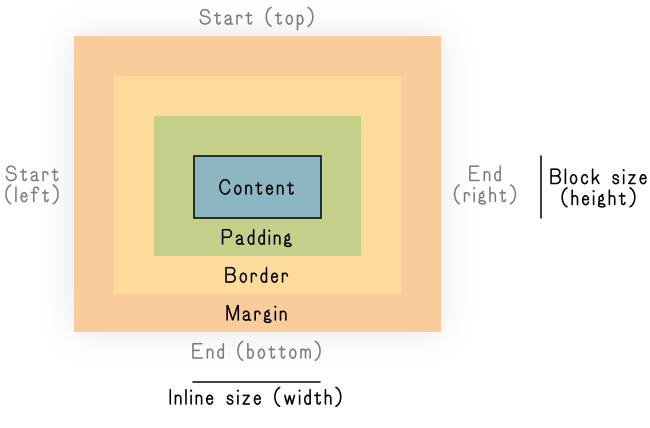
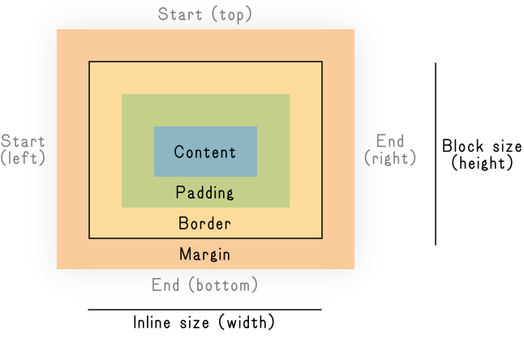

```javascript
const week = 5
const draft = true
```

# The Box Model

## Boxes Within Boxes Within Boxes Within Boxes

**For layout, we first need to understand how CSS sizes elements—and then how we can add space between them. This is called the [*the box model*](https://developer.mozilla.org/en-US/docs/Learn/CSS/Building_blocks/The_box_model), as everything on the web begins as a rectangle.**

- [<cite>Introduction to CSS Layout – MDN</cite>](https://developer.mozilla.org/en-US/docs/Learn/CSS/CSS_layout/Introduction) \
	As usual!

- [<cite>Layout – web.dev</cite>](https://web.dev/learn/css/layout/) \
	This gets into `grid` and `flex`; we’ll talk about those [next unit](../../syllabus.md#unit-2-there-is-no-perfect-layout).

- [<cite>Learn CSS Layout</cite>](https://learnlayout.com) \
	An old-but-still-good run-through.
<!-- .right .rows--3 -->

> …use the effectiveness of the former “background” quite deliberately, and consider the blank white spaces on the paper as formal elements just as much as the areas of black type.
>
> [<cite>Jan Tschichold, 1928</cite>](https://readings.design/PDF/ThePrinciplesoftheNewTypography.pdf)

### `box-sizing` Confusion

By default, all browsers’ *user-agent styles* have an unfortunate default—`box-sizing: content-box;`—which means that the `padding` (and `border`) exists *outside* the content `inline-size`/`width` or `block-size`/`height`—so `padding` (and `border`) is then an *outset.*

[<cite>`box-sizing` - MDN</cite>](https://developer.mozilla.org/en-US/docs/Web/CSS/Reference/Properties/box-sizing) \
	We’ll usually flip the default for this!
<!-- .right -->

<figure class="borderless verso">

<figcaption>

With `box-sizing: content-box;` per the spec.

</figcaption>
</figure>

<figure class="borderless recto">

<figcaption>

With `box-sizing: border-box;` the defacto standard. Most [CSS resets](../css/index.md#resets) will do this for you! Like we said, very common.

</figcaption>
</figure>


This is often unintuitive for designers and doesn’t fit with most web design patterns—so it is very, *very* common (nearly universal) to instead override this to `box-sizing: border-box;`—which makes `padding` and `border` exist *inside* the content dimensions. Then `padding` (and `border`) is easier to think of as an *inset*.

<sub>[W3C](https://www.w3.org/TR/css-box-3/) might have got this default wrong. Good ol’ CSS!</sub>


## What’s in *The Box*?

**Let’s take a look at this box, going *inside-to-outside.***

### Content

The [*content area*](https://developer.mozilla.org/en-US/docs/Web/CSS/Guides/Box_model/Introduction#content_area) is the guts of the element, usually text or an image. Its dimensions are usually defined by the [intrinsic size](https://developer.mozilla.org/en-US/docs/Glossary/Intrinsic_Size) of that content, but also can be specified directly via `width` or `height`—or `inline-size` and `block-size`. (More on those soon.)

[<cite>Introduction to the CSS box model - MDN</cite>](https://developer.mozilla.org/en-US/docs/Web/CSS/Guides/Box_model/Introduction#content_area) \
	Going inside-to-outside, the very inside.
<!-- .right -->

<figure style="--lines: 9">

***[Content Example](content/style.css)***

<figcaption>

Be sure to look at the HTML here! It’s a similar structure throughout.

</figcaption>
</figure>

> [!NOTE]
>
> All styles shown are now explicit! We’ve pulled our standard [CSS reset](../css/index.md#resets) into the `<head>` for all the examples, going forward.
>
> <sub>So now we are only seeing the styles that are expressly written out here—no user-agent defaults!</sub>

### Padding

Next comes [`padding`](https://developer.mozilla.org/en-US/docs/Web/CSS/padding), which adds space to the element’s area *around* the [content](#content). It’s easiest to think of this as an *inset* (if we’ve made our `box-sizing` the more-intuitive `border-box`, [above](#box-sizing-confusion)):
<!-- .balance -->

[<cite>Padding – MDN</cite>](https://developer.mozilla.org/en-US/docs/Web/CSS/padding) \
	There will be many of these links!
<!-- .right -->

<figure style="--lines: 15">

***[Padding Example](padding/style.css)***

</figure>

#### A Sidebar About *Shorthand*

Know that `padding`—and many other CSS properties, including `border` and <nobr>`margin`—</nobr>can be specified with a [*shorthand* property](https://developer.mozilla.org/en-US/docs/Web/CSS/Shorthand_properties) to make it “easier” to use the same spacing all around, or shared top/bottom and left/right.

[<cite>Shorthand Properties – MDN</cite>](https://developer.mozilla.org/en-US/docs/Web/CSS/Shorthand_properties) \
	Be wary of the siren call of shorthands!
<!-- .right -->

<section>
<div class="verso before">

|     |     |
| --- | --- |
|**1 value:**  | All Directions/sides           |
|**2 values:** | `top/bottom` `left/right`      |
|**3 values:** | `top` `left/right` `bottom`    |
|**4 values:** | `top` `right` `bottom`  `left` |

</div>

<div class="recto before center">

```css
section { padding: 1rem; }
section { padding: 1rem 2rem; }
section { padding: 1rem 2rem 4rem; }
section { padding: 1rem 2rem 4rem 2rem; }
```

</div>
</section>

<section style="margin-block-end: 2rlh">
<div class="balance verso before center">

These three- and four-value rules are often harder to read and quickly understand though, so we tend to avoid them. You can *always* write the individual directions out, for clarity! (And cleaner diffs, with separate/whole-line changes.)

</div>

<div class="recto before">

```css
section {
	padding-top: 1rem;
	padding-bottom: 4rem;
	padding-right: 2rem;
	padding-left: 2rem;
}
```

</div>
</section>

#### …and *Logical* Properties

You can also now define all your box model properties using [*logical* directions](https://developer.mozilla.org/en-US/docs/Web/CSS/CSS_logical_properties_and_values)—meaning instead of *physical* (`top`/`bottom`, `left`/`right`) orientations, you can [map your rules](https://adrianroselli.com/2019/11/css-logical-properties.html) to the *flow* of the text (`block-start`/`block-end`, `inline-start`/`inline-end`).
<!-- .balance -->

[<cite>CSS Logical Properties</cite>](https://adrianroselli.com/2019/11/css-logical-properties.html) \
	[Adrian Roselli](https://adrianroselli.com/) has a very thorough explanation.
<!-- .right -->

In horizontal, left-to-right writing modes (as in English):
<!-- .before -->

```css <!-- .verso -->
/* These physical directions: */
padding-top: 1rem;
padding-right: 1rem;
padding-bottom: 1rem;
padding-left: 1rem;


/* Also these physical sizes: */
height: 20rem;
width: 20rem;
```

```css <!-- .recto -->
/* Map to these logical directions: */
padding-block-start: 1rem;
padding-inline-end: 1rem;
padding-block-end: 1rem;
padding-inline-start: 1rem;

/* And these shorthand for both: */
padding-block: 1rem;
padding-inline: 1rem;

/* Become these logical sizes: */
block-size: 20rem;
inline-size: 20rem;
```

<sub>This `start` / `end` terminology will come up later with `flexbox` and `grid`, so it is a good habit/mindset to get into!</sub>

This allows your design/styles to behave in a *logically* (if not *physically*) consistent way across languages with varied [writing modes](https://developer.mozilla.org/en-US/docs/Web/CSS/writing-mode) and different [text directions](https://developer.mozilla.org/en-US/docs/Web/HTML/Global_attributes/dir). You can write styles that work even when your site is translated! (And the two-direction shorthand is nice, here.)
<!-- .before -->

> [!WARNING]
>
> We will *only* be using logical properties—they are the correct and modern way! Always be thinking in `block`/`inline`.
>
> <sub>You’ll see directions in other [resources](../../syllabus.md#attribution), but we should *not* see any `top`/`right`/`bottom`/`left` in your code!</sub>
<!-- #logical -->

</aside>

### Border

Back to our box model, moving outwards, with [`border`](https://developer.mozilla.org/en-US/docs/Web/CSS/border). Border is… the border around an element! It has its own `border-color`, `border-width`:
<!-- .balance -->

[<cite>Border – MDN</cite>](https://developer.mozilla.org/en-US/docs/Web/CSS/border)
	Our first non-text design element! You are allowed.
<!-- .right -->

<figure style="--lines: 11">

***[Border Example](border/style.css)***

<figcaption>

The shorthand `border-block-start` property value order here doesn’t matter! Isn’t CSS *…logical*.

</figcaption>
</figure>

#### Different `border-style` Options

There are also various [`border-style`](https://developer.mozilla.org/en-US/docs/Web/CSS/Reference/Properties/border-style) options to change the… style of border. You’ll most often see this for `dotted` lines, and as a *shorthand* for all sides—but we don’t get much control over them beyond `-color` and `-width`:

[<cite>`border-style` – MDN</cite>](https://developer.mozilla.org/en-US/docs/Web/CSS/Reference/Properties/border-style)
	Some of these are good; some of these are bad.
<!-- .right -->

<figure style="--lines: 19">

***[Border-style Example](border-style/style.css)***

<figcaption>

Look at all those borders.

</figcaption>
</figure>

#### Rounded Corners with `border-radius`

It’s much more common these days to see the [`border-radius`](https://developer.mozilla.org/en-US/docs/Web/CSS/Reference/Properties/border-radius) property, to give an element rounded corners. This is also how you can make simple ovals/circles—which are just rounded rectangles:

[<cite>`border-radius` – MDN</cite>](https://developer.mozilla.org/en-US/docs/Web/CSS/Reference/Properties/border-radius)
	“Sand down” your sharp edges.
<!-- .right -->

<figure style="--lines: 18">

***[Border-radius Example](border-radius/style.css)***

</figure>

### Margin

The last part of our box is [`margin`](https://developer.mozilla.org/en-US/docs/Web/CSS/margin)—the space *around* an element, empty/white-space area that is used to separate an element from its *siblings*. Like `padding` and `border`, you can specify it all around or on individual sides:
<!-- .balance -->

[<cite>Margin – MDN</cite>](https://developer.mozilla.org/en-US/docs/Web/CSS/margin) \
	The space between things.
<!-- .right -->

<figure style="--lines: 11">

***[Margin Example](margin/style.css)***

<figcaption>

This is away to *suggest* a multi-column feeling while keeping your reading flow clear.

</figcaption>
</figure>


#### *Negative* Margin?

Margin has a couple tricks up its sleeve. First, it can have *negative* values—which will eat up/cinch/remove space between elements—where `padding` and `border` can only add/take up space. Just add a minus before the value and  it will bring things closer together:
<!-- .balance -->

[<cite>Are negative CSS margins bad practice? – dev.to</cite>](https://dev.to/itstrueintheory/are-negative-css-margins-bad-practice-lh7) \
	Some example uses. “It depends!”
<!-- .right -->

<figure style="--lines: 11">

***[Negative Margin Example](margin-negative/style.css)***

<figcaption>

The first element pulls the second element closer with a *negative* margin.

</figcaption>
</figure>


#### Margin *Collapse*?

Also `margin` can [*collapse*](https://developer.mozilla.org/en-US/docs/Web/CSS/Guides/Box_model/Margin_collapsing), meaning that they are sometimes combined (*collapsed*) into a single value—whichever is largest—between two elements. This happens most often on adjacent siblings, and is both useful *and* an absolute pain, sometimes:

[<cite>Mastering margin collapsing – MDN</cite>](https://developer.mozilla.org/en-US/docs/Web/CSS/Guides/Box_model/Margin_collapsing) \
	Brilliant *or* annoying!
<!-- .right -->

<figure style="--lines: 13">

***[Margin Collapse Example](margin-collapse/style.css)***

<figcaption>

You might expect the margin between the first two `section` to be `12rem`, but it is only `8rem`! They have *collapsed* to the larger value.

</figcaption>
</figure>

## CSS Lengths

Okay, so now we have all these box properties—but how do we specify the dimensions? CSS has many [*length units*](https://developer.mozilla.org/en-US/docs/Web/CSS/length), used for `inline-size`, `block-size`, and also  `padding`, `border`, `margin`, and even `font-size`. (Picas, anyone?) We’ll look at some common ones.
<!-- .balance -->

[<cite>`<length>` – MDN</cite>](https://developer.mozilla.org/en-US/docs/Web/CSS/length)
	*Length* is used by many properties!
<!-- .right -->


### Absolute Units

<div class="balance verso center">

<div class="before sticky" style="inset-block-start: 33vh; margin-block-end: 2rlh">

Maybe the easiest ones to understand, these are fixed to physical (well… sort of) sizes.

In general, we try and avoid these in modern development as they are necessarily *brittle*. Remember: the web is not a “physical” medium!

<sub>With the many vagaries of screen size and density, the physical/ruler lengths will only be correct when you print. And maybe not even then!</sub>

</div>

</div>

<div class="before recto">

```css
/* An old/outdated length measurement. */
.pixels {
	block-size: 360px;
	inline-size: 720px;
}

/* These only make sense in print! */
.inches {
	block-size: 5in;
	inline-size: 10in;
}

.mm {
	block-size: 84mm;
	inline-size: 400mm;
}

.pt {
	block-size: 12pt;
	inline-size: 72pt;
}
```

</div>

### Relative Units

<div class="balance verso">

<div class="before sticky" style="inset-block-start: 33vh; margin-block-end: 2rlh">

Most of the time we want to use `relative` units, which depend on and respond to their context—particularly as we think ahead to *responsive* design.

These are based on our layout, viewport, or typography dimensions! And are much more resilient because of this systematic/relationship-based approach.

<sub>These are distinctly and intrinsically *web* measurements.</sub>

</div>

</div>

<div class="add-before recto">

```css
/* Relative to nearest “sized” ancestor. */
.percentage {
	block-size: 90%;
	inline-size: 75%;
}

/* Relative to viewport height/width. */
.viewport {
	block-size: 75vh;
	inline-size: 80vw;
}

/* Relative to `:root`/`html` font-size. */
/* These define our typographic systems! */
.rem {
	block-size: 12rem;
	inline-size: 2.4rem;
}

/* These are relative to an element’s font-size. */
/* `1em` is “one line.” */
.em { block-size: 14em; }

/* The cap height. */
.cap { block-size: 1cap; }

/* Roughly one letter width. */
.ch { inline-size: 1ch; }

/* The x-height. */
.ex { block-size: 1ex; }

/* A line-height (baseline to baseline). */
.lh { block-size: 1lh; }

/* These all have `:root`-relative versions too: */
/* `rch` `rcap` `rex` `rlh` */
```

</div>

> [!WARNING]
>
> Always default to relative units! Much like [logical properties](#and-logical-properties), these are the more correct and modern way.
>
> <sub>We should *not* see the absolute `px` in your code, despite whatever other [resources](../../syllabus.md#attribution) have!</sub>

### Combined via `calc()`

<div class="balance center verso">

Extending the idea of systematic/relationship-based dimensions, often you will want to use different units together! Mixing types or otherwise doing some maths, to express your design intent. For this we have the [`calc()` function](https://developer.mozilla.org/en-US/docs/Web/CSS/calc()).

</div>

<div class="add-before recto">

```css
.flexible-and-fixed {
	inline-size: calc(50% - 2rem);
}

.computer-do-the-math {
	inline-size: calc(100% / 12);
}
```

</div>

### Constrained by `min-`/`max-`

<div class="balance start before verso">

<div class="before sticky" style="inset-block-start: 45vh; margin-block-end: 2rlh">

You’ll often want to set limits/constraints on values—particularly with flexible, `relative` units (and *responsive design*, which we’ll talk about soon.)

You can usually set [*minimums*](https://developer.mozilla.org/en-US/docs/Web/CSS/min-inline-size) and [*maximums*](https://developer.mozilla.org/en-US/docs/Web/CSS/max-block-size) by using the prefixes `min-` and `max-`.

</div>

</div>

<div class="recto">

```css
.constrained-width {
	min-inline-size: 12rem;
	inline-size: 50%;
	max-inline-size: 24rem;
}

.constrained-height {
	min-block-size: 6rem;
	block-size: 100%;
	max-block-size: 12rem;
}

/* Handy to watch your line lengths! */
p {
	max-inline-size: 65ch; /* 65ish letters. */
}
```

</div>

### Defined as `--variable`

[Custom properties](https://developer.mozilla.org/en-US/docs/Web/CSS/Using_CSS_custom_properties) (folks almost always say *CSS variables*) aren’t strictly *units*, per se—but they’re used in conjunction with them. They allow you to *codify* the relationships in your design!
<!-- .balance -->

[<cite>CSS Custom Properties Guide – CSS Tricks</cite>](https://css-tricks.com/a-complete-guide-to-custom-properties/)
	Web guru [Chris Coyier’s](https://chriscoyier.net/) robust overview.
<!-- .right -->

<section class="before" style="margin-block-end: 1rlh">
<div class="before balance verso">

These bring another programming concept of [*variables*](https://en.wikipedia.org/wiki/Variable_(computer_science)) into CSS. These are shorthand entities for *any* values (not just lengths) we want to reuse throughout a document.

Changing the value of a *variable* changes it everywhere it is referenced—no copy/pasting or find/replacing. You could think of a color *swatch*, if you are in an Adobe mindset; other tech folks call these *tokens*. Again, these are just for you—it is all the same to the computer. More ergonomics!

In your CSS, you *declare* (set) these with a `--` prefix in front of a subjective name you make up, akin to a class name. And you *reference* (use) them by wrapping that variable name in `var()`.

**You’re saying “these things are *meant* to be the same.”**

</div>

<div class="recto before">

```css <!-- .sticky -->
/* Special “entire document” selector, akin to `html`. */
:root {
	/* Declare them: */
	--brand-color: #e42a1d;
	--base-spacing: 2rem;
}

main {
	/* Reference them: */
	color: var(--brand-color);
	padding: var(--base-spacing);

	/* Or build from them: */
	margin-block: calc(2 * var(--base-spacing));
}
```

</div>
</section>

<figure style="--lines: 25">

***[Variable Example](css-variable/setup.css)***

<figcaption>

The convention is to declare “global” variables on `:root`—but you can override within other rules, as in the `style.css` here.

</figcaption>
</figure>


> [!NOTE]
>
> We should always be thinking about our work as *design systems*!
>
> Using [relative units](#relative-units), [`calc()`](#combined-via-calc), [`min-`/`max-`](#constrained-by-min-max), and (particularly) [`--variable`](#defined-as-variable) are ways to establish and enforce these relationships.
>
> <sub>We should see lots of `calc()` and `--variable` use in your code! It shows us systematic thinking and your design *intent*.</sub>

---

**CSS is big and massive and overwhelming and sometimes indefensibly nonsensical—but remember that you can do a surprising amount with *just* these basic properties!**

**And no matter how complex it gets, it really always comes back to these basics.**

## Positioning

With an idea of how elements take up space, now we’ll look at how they exist and move together in the [*document flow*](https://developer.mozilla.org/en-US/docs/Learn/CSS/CSS_layout/Normal_Flow). The CSS property `position` [sets this relationship](https://developer.mozilla.org/en-US/docs/Web/CSS/position).
<!-- .balance -->

[<cite>Position – MDN</cite>](https://developer.mozilla.org/en-US/docs/Web/CSS/position)
	Interesting web work often uses `position`.
<!-- .right -->

### Static

By default, every element is `static`—just meaning its normal, stacked position in the document.
<!-- .balance -->

<sub>You’ll rarely, if ever, actually set this yourself—it’s the default!</sub>

<figure style="--lines: 13">

***[Static Example](position-static/style.css)***

<figcaption>

Nothing changes here—`static` is the default. Be sure to scroll these examples!

</figcaption>
</figure>

### Relative

The first thing we might want to do is adjust an element *from* that normal `static` position, which we can do with `relative` positioning.
<!-- .balance -->

Once you have set `position: relative;` you can use the logical `inset-block-start`, `inset-inline-end`, `inset-block-end`, and `inset-inline-start` values (with any of [the units](#and-their-units), above) to move the element away from its default, normal position in the flow:
<!-- .balance -->

<figure style="--lines: 13">

***[Relative Example](position-relative/style.css)***

<figcaption>

Note the space—the element still exists/takes up space in the *flow*.

</figcaption>
</figure>

### Absolute

`absolute` positioning is somewhat similar to `relative`—but instead of placing an element in relation to its own default position, it uses the position of its nearest *positioned* ancestor as the origin.
<!-- .balance -->

So `absolute` elements will go “up the tree” of parents and wrapper elements until they find one set to anything other than default/<nobr>`static`—</nobr>then the same offset properties the element around from there.
<!-- .balance -->

Importantly, `position: absolute;` also *removes* the element from the normal document flow—meaning it no longer takes up *any space* in the page layout!
<!-- .balance -->

<sub>This is often used for exacting, specific design element placement. But it is inherently *brittle*&NoBreak;!</sub>

<figure style="--lines: 24">

***[Absolute Example](position-absolute/style.css)***

<figcaption>

The element is out of the *flow*, and placed according to the `relative` parent.

</figcaption>
</figure>

### Fixed

`fixed` positioning also removes the element from the document flow, but it places elements with relation to the *browser viewport*—the boundaries of the window or device.
<!-- .balance -->

So `position: fixed;` brings the element *completely* out of the page’s normal flow, like it is sitting on its own separate layer.
<!-- .balance -->

<sub>This is often used for things like navigation elements.</sub>

<figure style="--lines: 13">

***[Fixed Example](position-fixed/style.css)***

<figcaption>

Try doing this in print.

</figcaption>
</figure>

### Sticky

The most recent addition to the *position* party, `position: sticky;` elements are placed according to the normal flow of the document, like `static`, until their nearest *scrolling ancestor* (usually the viewport) moves past them. The element is then *stuck* in relation to this element.
<!-- .balance -->

<sub>This is often used for headers on tables and lists.</sub>

<figure style="--lines: 13">

***[Sticky Example](position-sticky/style.css)***

<figcaption>

You’ll hear Michael say this a lot: this always feels very *web*-y.

</figcaption>
</figure>

### “Depth” with `z-index`

Okay, `z-index` is not strictly *positioning*—it is a separate property. You can see that all these `position` properties have given us ways to make things overlap, and `z-index` is how we can decide the *front-to-back* ordering (think [*<nobr>z-axis</nobr>*](https://en.wikipedia.org/wiki/Cartesian_coordinate_system#Three_dimensions)).
<!-- .balance -->

- [<cite>`z-index` – MDN</cite>](https://developer.mozilla.org/en-US/docs/Web/CSS/z-index)
	This can be tricky to work with!
<!-- .right -->

By default, items that are lower in the HTML (coming *after* each other) are in front of higher, earlier elements:
<!-- .balance -->

<figure style="--lines: 16">

***[Z-index Example](z-index/style.css)***

<figcaption>

The two `position` properties both create new stacking contexts, `z-index: 1;` moves even elements in front.

</figcaption>
</figure>

A whole lot of things make a new [*stacking context*](https://developer.mozilla.org/en-US/docs/Web/CSS/CSS_Positioning/Understanding_z_index/The_stacking_context) (including most `position` changes) which is kind of like a *group* (or a Figma *frame*) that has its own internal depth/overlap order.
<!-- .balance -->

No amount of internal `z-index` adjustments can “break” something out of that group—which is one of the reasons why *z* can be really difficult to understand and tricky to use. But you can always adjust the `z-index` of the group, as we do here!
<!-- .balance -->

## Display

In our [HTML introduction](../html/index.md) we briefly talked about `block` and `inline` elements—as set by the user-agent styles. These are the first two examples of [the `display` property](https://developer.mozilla.org/en-US/docs/Web/CSS/display).
<!-- .balance -->

[<cite>Display – MDN</cite>](https://developer.mozilla.org/en-US/docs/Web/CSS/display)
	Our `block` and `inline` elements (and later, `grid` and `flex`).
<!-- .right -->

### Block

As we discussed, many HTML elements are [*block-level*](../html/index.md#block-elements) by default. But you can also set `display: block;` manually on an `inline` element, too. This would mean that it starts on a new line, takes up the full width available, and you can specify a `block-size`, `inline-size`, and use `margin` above and below:
<!-- .balance -->

<figure style="--lines: 13">

***[Display Block Example](display-block/style.css)***

<figcaption>

Whenever you are linking a whole area (like an image and text together), safe bet that you want `block`.

</figcaption>
</figure>

### Inline

And then going the other way, you can force *block* elements to be [*inline*](../html/index.md#inline-elements) with `display: inline;`. They will no longer start on their own lines, will only take up as much space as their content/children, and *don’t* accept `block-size` or `inline-size` (or any `-block-start`/`-block-end`) properties:
<!-- .balance -->

<figure style="--lines: 11">

***[Display Inline Example](display-inline/style.css)***

<figcaption>

The [`white-space` property `pre`](https://developer.mozilla.org/en-US/docs/Web/CSS/white-space)-vents the spaces in the paragraphs from collapsing!

</figcaption>
</figure>

### But Also `inline-block`

You can also combine the qualities of `block` and `inline` with `display: inline-block;`. These elements take `block-size` and `inline-size` (and vertical `margin`) like *block-level* elements, but do not start on their own line:
<!-- .balance -->

<figure style="--lines: 15">

***[Display Inline-Block Example](display-inline-block/style.css)***

</figure>

### And Sometimes `none`

Setting `display: none;` hides an element visually (and from screen readers) in the document—as well as taking it out of the *flow*. (Keep in mind the HTML is still there, if someone opens up the source code.)
<!-- .balance -->

This is a common way to hide/show (by setting another `display` property) elements on the page, but it will *reflow* the document when applied—as if the element is actually added/removed from the HTML:
<!-- .balance -->

<figure style="--lines: 7">

***[Display None Example](display-none/style.css)***

<figcaption>

Poof. Like it wasn’t even there.

</figcaption>
</figure>

#### …vs. Visibility?

You can also hide something visually *without* taking it out of the document *flow,* which is useful when you don’t want the page to jump/*reflow* when something appears/disappears.
<!-- .balance -->

[<cite>Visibility – MDN</cite>](https://developer.mozilla.org/en-US/docs/Web/CSS/visibility)
	This also hides elements from assistive technologies (screen readers).
<!-- .right .rows--2 -->

Setting `visibility: hidden;` keeps the space an element had before, but makes it invisible and unable to be interacted with. The value `visible` is the default:
<!-- .balance -->

<figure style="--lines: 7">

***[Visibility Example](visibility/style.css)***

</figure>

#### …vs. Opacity?

Another way to hide an element visually is to adjust `opacity`, which uses values on a scale from `0`&NoBreak;–&NoBreak;`1` or `0%`&NoBreak;–&NoBreak;`100%`. This differs from `visibility` because elements with no (or partial) opacity can still be interacted with:
<!-- .balance -->

[<cite>Opacity – MDN</cite>](https://developer.mozilla.org/en-US/docs/Web/CSS/opacity)
	The entire element *and* its descendents are adjusted, as one.
<!-- .right  -->

<figure style="--lines: 7">

***[Opacity Example](opacity/style.css)***

<figcaption>

You can still select the text (or click links) of not-fully-opaque elements.

</figcaption>
</figure>

Keep in mind that `display: none;`, `visibility: hidden;`, and `opacity: 0;` only hide things in the *rendered* browser view. The HTML is always still visible in the source code!
<!-- .balance -->

## What About Floats?

Oh right, floats. Sometimes you’ll want to have an image or block flow within a block of text. There are a lot of ways to do this now, but the oldest (and sometimes still the trickiest) is a [`float`](https://developer.mozilla.org/en-US/docs/Learn/CSS/CSS_layout/Floats).
<!-- .balance -->

[<cite>Floats – MDN</cite>](https://developer.mozilla.org/en-US/docs/Learn/CSS/CSS_layout/Floats)
	You don’t see these used as much anymore!
<!-- .right -->

> [!NOTE]
>
> Generally, folks try and avoid floats—they aren’t common in modern design patterns and have been giving people headaches for decades now.
>
> <sub>They require you to know how long your content is and also how big your viewport/page will be—*both* things that you don’t always have control over in responsive/mobile 2026. But *occasionally* they are still the only thing that can do what you need!</sub>

### Left and Right

The declarations `float: inline-start;` and `float: inline-end;` take an element out of the normal flow and place it on the left or right side of its parent container.
<!-- .balance -->

Any text *siblings* will then flow around the element—like a *text wrap*—filling up any available space to its side. They will go as far up as the top of the *floated element*:
<!-- .balance -->

<figure style="--lines: 15">

***[Float Example](float/style.css)***

</figure>

### Don’t Forget to `clear`

Since this takes the floated element out of the *flow*, if we want the following element (often another text block, like a `<p>`) to not move up it needs to be *cleared* with `clear: inline-start;` , `clear: inline-end;`, or `clear: both;`.
<!-- .balance -->

Applied on the following element, it will make it stay entirely below (clear of) the *floated* element:
<!-- .balance -->

<figure style="--lines: 17">

***[Float/Clear Example](float-clear/style.css)***

<figcaption>

Uh oh, classic `float` problem on the second one.

</figcaption>
</figure>

If you have a parent wrapper and no following element, there won’t be anything there to *clear* the float—meaning the parent will collapse down to the size of the text content. Almost never what you want.
<!-- .balance -->

You can solve this broken look with a [*clearfix hack*](https://developer.mozilla.org/en-US/docs/Web/CSS/clear#sect1), which uses a pseudo-element as an ersatz `last-child` to clear the container.
<!-- .balance -->

<figure style="--lines: 21">

***[Float Clearfix Example](float-clearfix/style.css)***

<figcaption>

Much better. `:after` is a pseudo-element—which acts here as a last child that clears the `div`.

</figcaption>
</figure>

## What about *flex* and *grid*?

**We’ll cover these [next unit](../../syllabus.md#unit-2-there-is-no-perfect-layout)! They’ll make your (layout) life easier. But again, you’ll always be using the *box-model* concepts here.**

> ``` <!-- @nested="true" -->
> E.g.:
> ____________
>
>  H1 has a 1 character left margin
>
>  So does H2
>
>       P starts here and could
>       go on forever. Wow, a 5
>       character left margin
>       sure looks great!
>        _____
>       | + + | Wow, you can do
>       |  @  | images as well?
>       | --- | Then you'll
>       |_____| want a 1 character
>       margin on the left side.
>       Until, you're below the
>       image that is.
> _____________
>
> This is where we the simple stacked
> box model is a bit too simple.
> ```
>
> [<cite>Håkon Wium Lie, 1995</cite>](https://lists.w3.org/Archives/Public/www-style/1995Jun/0003.html)
