```javascript
const week = 4
const order = 2
```

# DevTools&#x202F;/&thinsp;Web Inspector

## Browsers Are Our Imperfect Venue

**There is no single *best* browser; they are all kind of differently bad, in [different ways](https://en.wikipedia.org/wiki/Anna_Karenina_principle).**

- [<cite>Chrome DevTools</cite>](https://developer.chrome.com/docs/devtools/) \
We’ll be using these.

- [<cite>Safari Web Development Tools</cite>](https://developer.apple.com/safari/tools/) \
Got some long-overdue love way back in [*Sonoma*](https://developer.apple.com/videos/play/wwdc2023/10118), but [little](https://webkit.org/blog/15865/webkit-features-in-safari-18-0/#web-inspector) [since](https://webkit.org/blog/17333/webkit-features-in-safari-26-0/#web-inspector) [then](https://webkit.org/blog/17967/news-from-wwdc26-webkit-in-safari-27-beta/#web-inspector).

- [<cite>Firefox DevTools User Docs</cite>](https://developer.mozilla.org/en-US/docs/Tools) \
Spiritual successor to [*Firebug*](https://thehistoryoftheweb.com/checking-under-the-hood-of-code/), the first suite.
<!-- .right .rows--4 -->

Many developers use [Chrome](https://www.google.com/chrome) for [its popularity/hegemony](https://gs.statcounter.com/browser-market-share), before testing in other browsers. It also arguably has the most robust set of *DevTools*—though [Safari](https://www.apple.com/safari/) and [Firefox](https://developer.mozilla.org/en-US/docs/Tools) have their own versions, too. Much of this is just preference, but ultimately you’ll want to see what your visitors are seeing.
<!-- .before -->

You have always [been able to](https://blog.jim-nielsen.com/2020/the-spirit-of-view-source/#how-browsers-do-view-source-today-on-mac) <samp>View Source…</samp>, from [the earliest days/browsers](https://thehistoryoftheweb.com/checking-under-the-hood-of-code/)—remember that the open web has *always* trafficked in source code. But we’ll use DevTools for the same reason we use an IDE—more comfortable ergonomics, specifically around building for the web.
<!-- data-description -->

You’ll often hear people (Michael) call it the *Web Inspector*, or just *The Inspector*. It’s going to be your best (Web) friend, showing you everything that the browser has *parsed* to display your pages.

## Inspecting Pages

<div class="center verso">

In Chrome, you can bring them up by right-clicking on any element/part of a page and clicking <samp>Inspect</samp>:

By default, you’ll see the tools open on the right side of the page. Depending on how big your screen is, they might be laid out a bit differently—but the basics are usually the same:

You can also hit <nobr><kbd><span class="x2318">⌘</span>/Ctrl</kbd>+<kbd><span class="x2325">⌥</span>/Alt</kbd>+<kbd>I</kbd></nobr>.

</div>

<figure class="recto justify-center borderless center" style="--height: 273px">
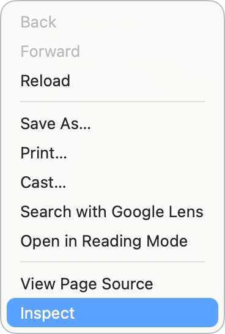
</figure>


<figure class="all justify-center borderless">
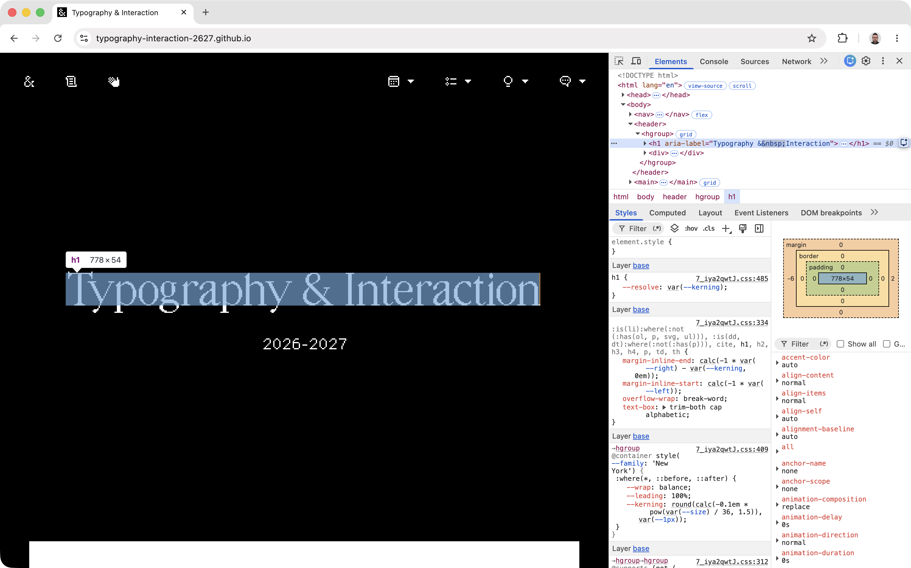
</figure>

<div class="before center verso balance">

The Customize <samp><span class="x22ee">⋮</span></samp> button will let you change the side they appear on, or undock the tools out entirely into a separate window—sometimes easier on a laptop/small screen:

</div>

<figure class="recto borderless justify-end">
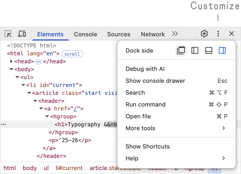
</figure>

## Elements Panel

<div class="verso">

The top part of the tools is [*the DOM*](https://developer.mozilla.org/en-US/docs/Web/API/Document_Object_Model/Introduction)—you can expand/collapse all the nested HTML *elements* on the opened page.

The first <samp><span class="x21f1">⇱</span></samp> button in the upper-left lets you mouse over on the page, and will then show you that element nested/hierarchically within the DOM.

The second <samp><span class="x2ff8">⿸</span></samp> button (more about this [below](#device-mode)) toggles the *Device Toolbar*, a.k.a. “responsive mode.”

The <samp>flex</samp>/<samp>grid</samp> badges (pills?) toggle their layout overlays on the page.

</div>

<figure class="center recto borderless justify-end">
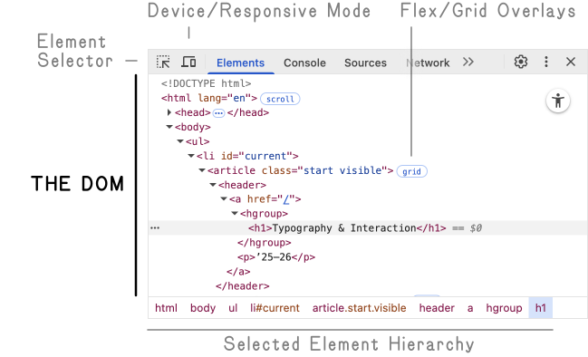
</figure>

<sub>Handy tip: <nobr><kbd><span class="x2318">⌘</span>/Ctrl</kbd>+<kbd>F</kbd></nobr> in here will let you search for elements or text by name/class/contents!</sub>
<!-- .right style="margin-block-start: initial" -->

## Styles Tab

<div class="verso">

The area below is for the styles. It shows whatever *CSS properties* apply to the element you have selected above, in the DOM/Elements panel.

These are ordered (somewhat unintuitively) in a *more*-[specific](../css/index.md#specificity), *reverse*-[cascade](../css/index.md#oh-right-the-cascade) sequence—inline styles at the top, external and internal stylesheets, then *user-agent* styles at the bottom—with any cascading/conflicting rules crossed out, as you go down.

On the right, you can see the sum *Computed* (or *rendered*) values of all the rules that apply—regardless of where they come from. These represent *exactly* what the browser is showing to you for the selected element.

</div>

<figure class="center recto borderless justify-end">
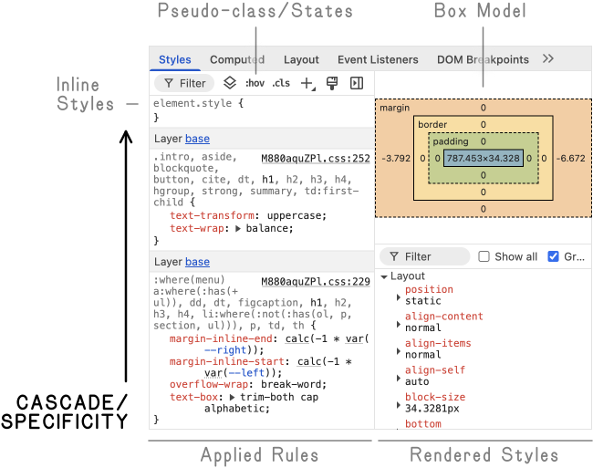
</figure>

<sub>You can type specific CSS properties/values into both <samp><span class="x25bd">▽</span> Filter</samp> boxes to quickly narrow things down!</sub>
<!-- .right style="margin-block-start: initial" -->

**You can make changes in Elements or Styles, and the edits will be immediately visible on the page *as if you had edited the source files*!**

**It’s useful to try things out quickly—and diagnose where problems/conflicts arise.**

> [!WARNING]
>
> DevTool edits are temporary! Keep in mind that these changes are only in your browser session.
>
> <sub>Any edits in the DevTools will be lost when you leave or reload the page! They are just for you.</sub>

## Device Mode <!-- inert -->

Enter *device mode* with the little phone/laptop <samp><span class="x2ff8">⿸</span></samp> button, in the upper left of the DevTools:

<figure class="all justify-center borderless">
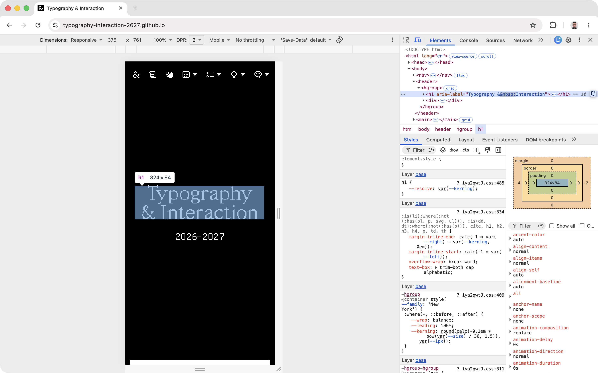
<figcaption>

Be sure to *hard-refresh* with <nobr><kbd><span class="x2318">⌘</span>/Ctrl</kbd>+<kbd><span class="x21e7">⇧</span>/Shift</kbd>+<kbd>R</kbd></nobr> (to clear the cache) if the page doesn’t rescale correctly when you enter this mode! They sometimes don’t, depending on how they are built—especially with JS shenanigans.

</figcaption>
</figure>

<figure class="all borderless">
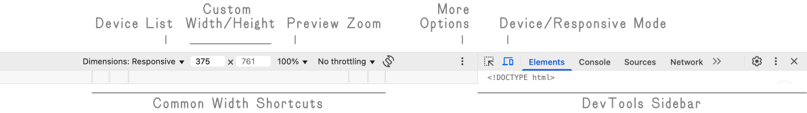
</figure>

<div class="center left">

Generally, use the <samp>Responsive <span class="x25be">▾</span></samp> mode that lets you type in specific pixel dimensions for width/height. Or you can use the divided bar underneath to quickly jump through common/ballpark widths.

The *Preview Zoom* also allows you to approximate views *larger* than your current screen! You can specify larger dimensions, and it will scale down to show the entire viewport. This is great for developing on a laptop—it won’t be precise, but it’ll give you some idea of big screens.

</div>

<figure class="start middle borderless" style="--height: 489px">
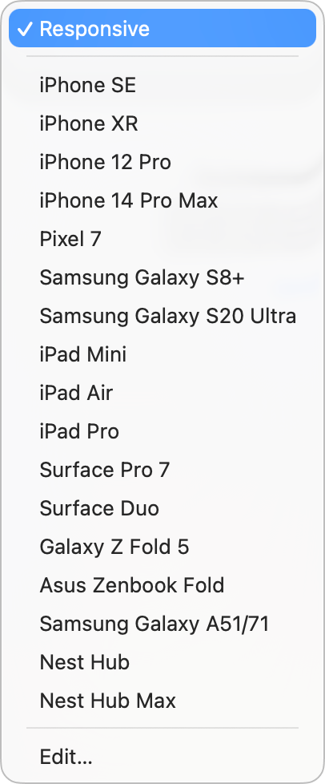
<figcaption>

The <samp>Device List <span class="x25be">▾</span></samp> is… *ancient* and inaccurate—they don’t account for the browser’s own interface, so they are all too tall!

</figcaption>
</figure>

<figure class="right borderless" style="--height: 260px">
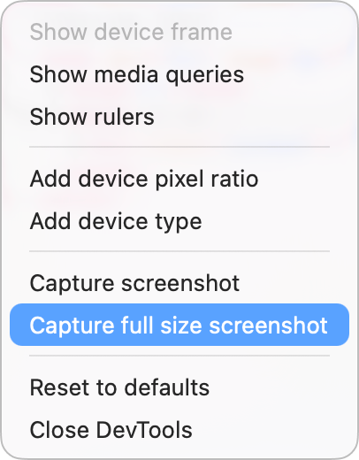
<figcaption>

The <samp>More Options <span class="x22ee">⋮</span></samp> menu here has some handy tricks!

</figcaption>
</figure>

**Remember that you are not targeting specific devices; you are looking for when your design/content *breaks*!**


> [!IMPORTANT]
>
> Always check your work on the *real thing*. DevTools are only an approximation!
>
> <sub>This is just a quicker preview, but isn’t always perfectly accurate—and also won’t reflect any platform-specific behaviors around scrolling or rotating. (We’re looking at you, [<small>i</small>OS Safari](https://developer.apple.com/forums/thread/800125).)</sub>

## The Console <!-- inert -->

<div class="verso start">

The console is used to help you work with [JavaScript](../javascript/index.md), by *logging* messages, warnings, and any errors from your code as it runs. It can also evaluate written/pasted JS, live.

If your tools are already open, you can show the <samp>Console</samp> (as a drawer, below) with the Customize <samp><span class="x22ee">⋮</span></samp> button, or as a whole panel to the right of <samp>Elements</samp>.

<sub>You can also hit <nobr><kbd><span class="x2318">⌘</span>/Ctrl</kbd>+<kbd><span class="x2325">⌥</span>/Alt</kbd>+<kbd>J</kbd></nobr> to go right there!</sub>

</div>

<figure class="recto justify-end borderless">
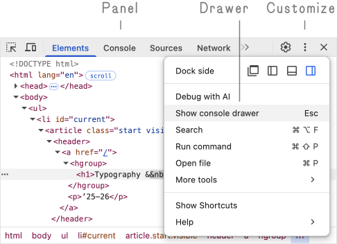
</figure>

<figure class="all justify-center borderless">
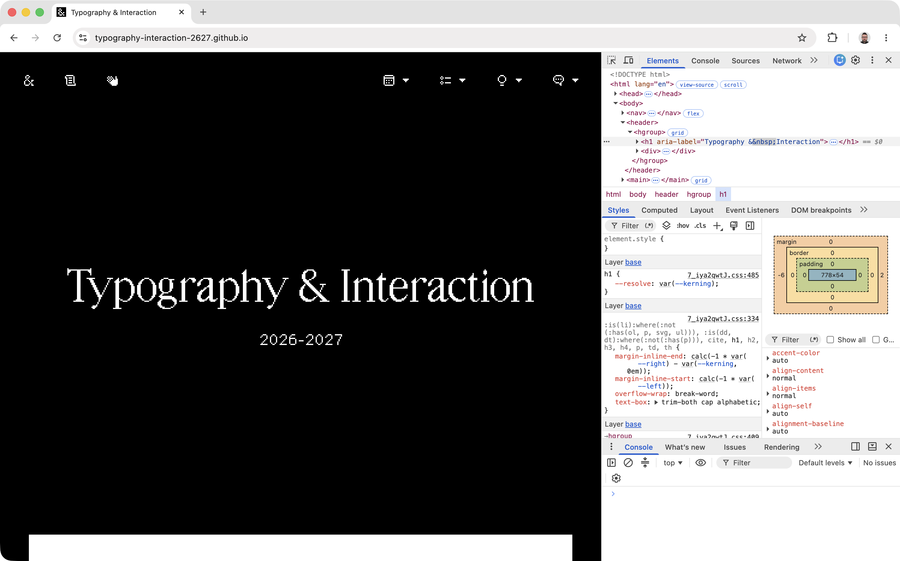
<figcaption>

The Console opened under Elements/Styles.

</figcaption>
</figure>

**This area will show any [messages logged](https://developer.mozilla.org/en-US/docs/Web/API/console#outputting_text_to_the_console) from your JavaScript with `console.log()`.**

<div class="balance verso">

**<span>Warnings</span>** and **<span>errors</span>** (like missing files, or bad JS syntax) will also be shown here—usually with clickable <samp>script.js:##</samp> line-numbers to the right, to take you directly to the problem. You can clear the *buffer* (what is showing) with the little crossed circle <samp><span class="x2298">⊘︎</span></samp> when it gets cluttered.

You can also evaluate and try your JavaScript here *directly*, by typing (with some nice auto-completion) into the bottom of the console—like `console.log('Hello, world!')` (note the quotes for [a *string*](https://developer.mozilla.org/en-US/docs/Web/JavaScript/Reference/Global_Objects/String)).

You can use this to test out parts of your code right away, like `document.querySelector('h1')`. If it *returns* (shows) your element in response, your selector is working!

</div>

<div class="center recto">

<figure class="borderless">
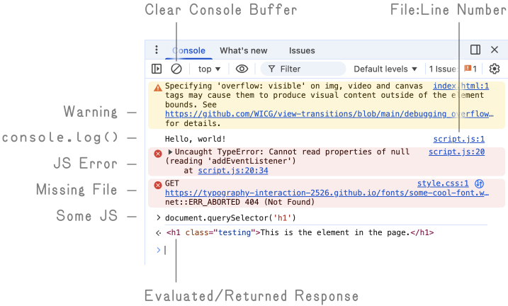
</figure>

</div>

> [!TIP]
>
> The Console has many uses! And not *just* when things go wrong.
>
> <sub>Check your variables by printing them out with `console.log('Variable: ' + variableName)`, <br>or just make sure that part of your code ran with `console.log('Made it here!')`.</sub>
