```javascript
const week = 1
```

# Everything Is a “Web Page”

## Let’s Start With *The Internet*

### When Was *The Internet* Invented?

<details>
<summary>

*The Internet* was invented in…

</summary>

**1969!**

</details>

Before this time, the term *computer* usually referred to a person, not a machine—someone who would *compute* (solve) math problems by hand!

<figure>

<figcaption>

The [*Harvard Computers*](https://en.wikipedia.org/wiki/Harvard_Computers) in the late 1800s. [<cite>↗</cite>](https://en.wikipedia.org/wiki/Harvard_Computers#/media/File:Astronomer_Edward_Charles_Pickering%27s_Harvard_computers.jpg)

</figcaption>
</figure>

> [!NOTE]
>
> These pioneers [were often women](https://www.nytimes.com/2019/02/13/magazine/women-coding-computer-programming.html)! And they were usually underpaid and underrecognized compared to men in their field. Many would go on to operate the early mechanical and electronic computers.
>
> <sub>We’re going talk about a lot of men, here—but know that women have been [present and essential](https://en.wikipedia.org/wiki/History_of_computing#Important_women_and_their_contributions) from the start, as usual.</sub>

By the 1960s, computers were [room-sized, institutional electronic machines](https://en.wikipedia.org/wiki/History_of_computing_hardware_(1960s%E2%80%93present)) owned by governments (the military), businesses, and universities. They were used to solve complex math problems and sort data, but were still very slow and didn’t communicate with one another.

<figure>
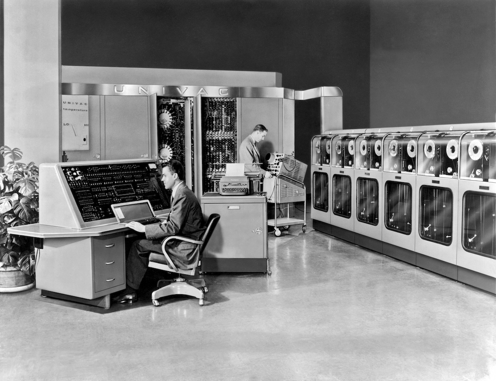
<figcaption>

Univac, the first commercial computer in the US. [<cite>↗</cite>](https://time.com/4271506/census-bureau-computer-history/)

</figcaption>
</figure>

A catalyst in the formation of the internet was the [Cold War](https://en.wikipedia.org/wiki/Cold_War). The threat of nuclear conflict spurred the US Defense Department to consider decentralized and distributed communication networks—to disseminate orders and information in the event of an attack (and ultimately, for retaliation).

<figure class="aside">
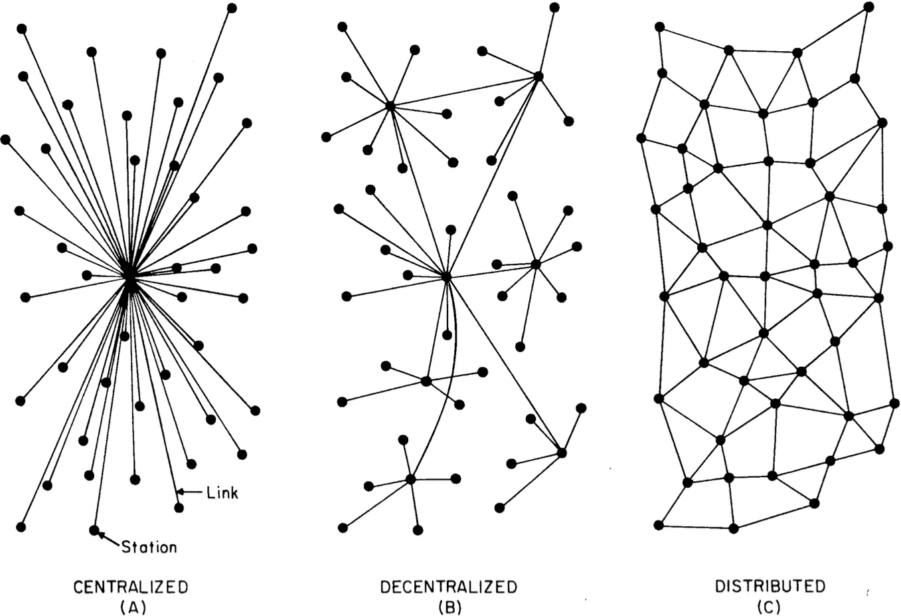
<figcaption>

Different network topologies. [<cite>↗</cite>](https://www.rand.org/content/dam/rand/pubs/research_memoranda/2006/RM3420.pdf)

</figcaption>
</figure>

> It was necessary to have a strategic system that could withstand a first attack and then be able to return the favor in kind.
>
> The problem was that we didn’t have a survivable communications system, and so Soviet missiles aimed at US missiles would take out the entire [system] that was highly centralized.
>
> Well, then, let’s not make it centralized. Let’s spread it out so that we can have other paths to get around the damage.
>
> [<cite>Paul Baran, 2008</cite>](https://www.vanityfair.com/news/2008/07/internet200807)

<figure style="--lines: 16">
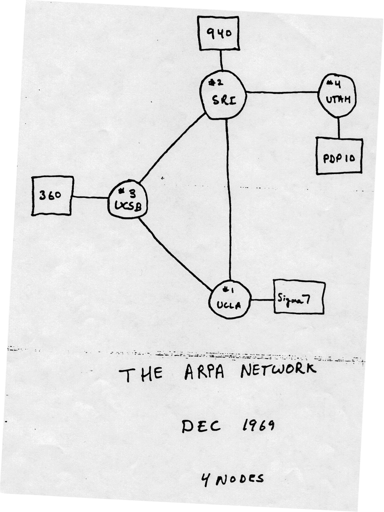
<figcaption>

The original sketch of ARPANET (*Advanced Research Projects Agency Network*). [<cite>↗</cite>](https://www.scientificamerican.com/gallery/early-sketch-of-arpanets-first-four-nodes/)

</figcaption>
</figure>

By 1969, computer nodes [connected](https://en.wikipedia.org/wiki/History_of_the_Internet#Networks_that_led_to_the_Internet) the Stanford Research Institute, UCLA, UCSB and the University of Utah—developed by the Defense Department’s *Advanced Research Project Agency* (ARPA).

Over the following decade, [ARPANET](https://www.britannica.com/topic/ARPANET) would grow to include other networks and reach more cities in the US. It had its first expansion outside the States in 1973, with connections to the UK and Norway. Slowly, similar commercial and academic networks were developing alongside, each with their own communication protocols.

<figure>
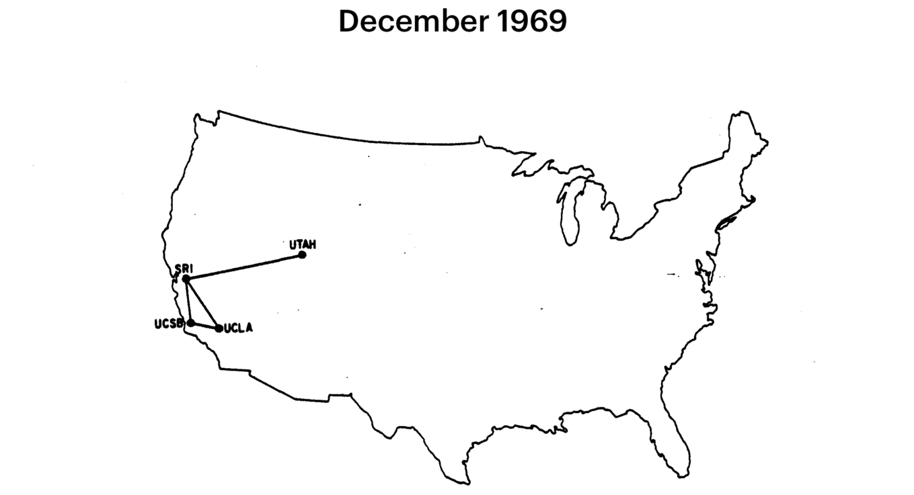
<figcaption>

The growth of ARPANET into the 1970s. [<cite>↗</cite>](https://medium.com/syntropynet/the-internet-was-not-developed-it-just-happened-part-1-a123fe4628)

</figcaption>
</figure>

In 1974, Robert Kahn and Vinton Cerf (two ARPA scientists) developed the *Transmission Control Protocol* and the *Internet Protocol* (TCP/IP) for computers to talk to each other. By the 80s, it became the standard network communication format—and still underpins the internet we all use today.

<figure class="recto">
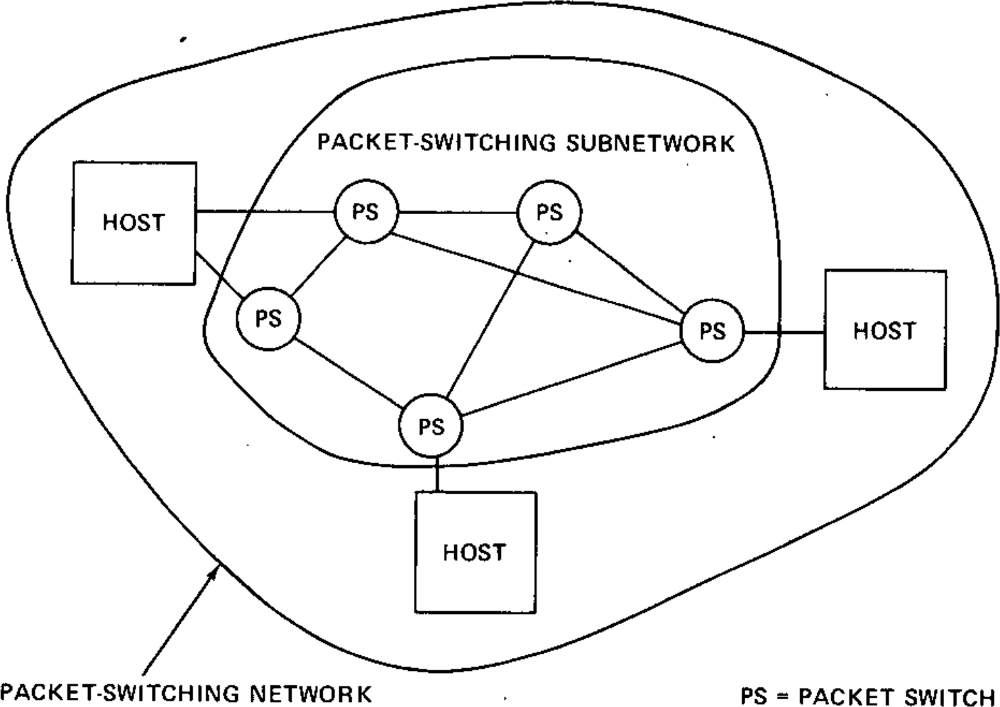
<figcaption>

The core of TCP/IP is routing bundles of data called *packets.* [<cite>↗</cite>](https://web.eecs.umich.edu/~prabal/teaching/eecs582-w13/readings/CK74.pdf)

</figcaption>
</figure>

## What About *The Web*?

### When Was *The Web* Invented?

<details>
<summary>

*The Web* was invented in…

</summary>

**1989!**

</details>

<figure>
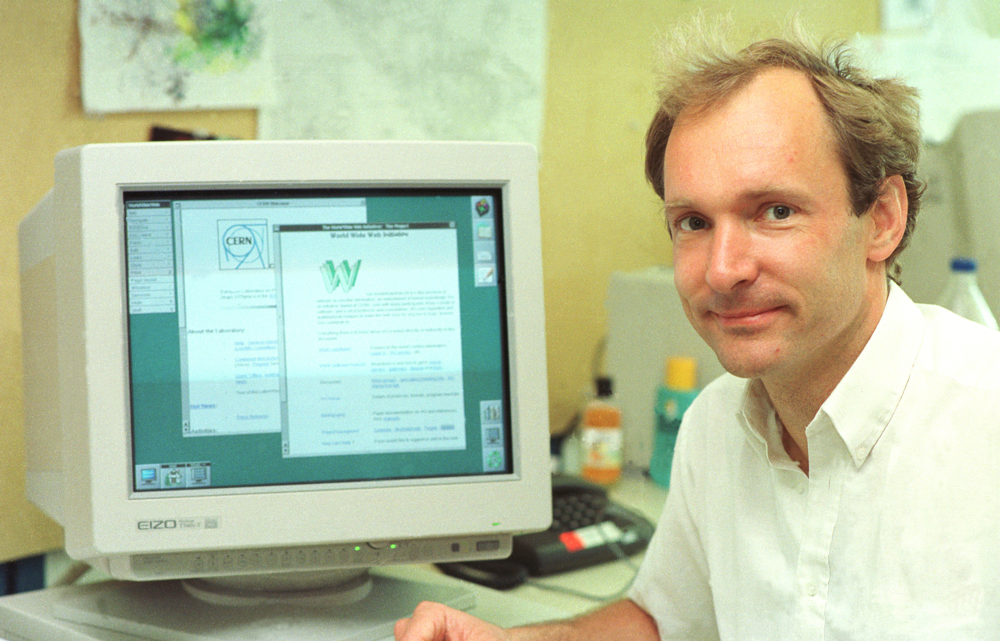
<figcaption>

Our guy Tim. [<cite>↗</cite>](https://cds.cern.ch/images/CERN-GE-9407011-31)

</figcaption>
</figure>

Tim Berners-Lee, a British academic and scientist, invented the *World Wide Web* (WWW) with his team while working at [CERN (*European Organization for Nuclear Research*) in 1989](https://home.cern/science/computing/the-birth-of-the-web/short-history-web/). It was developed on top of TCP/IP as a standard way to connect documents, living on different computers in different places, via *hypertext* links.

> [!NOTE]
>
> Tim and his colleagues were heavily influenced by [*HyperCard*](https://en.wikipedia.org/wiki/HyperCard)—an early *hypermedia* application.
>
> <sub>[Bill Atkinson](https://en.wikipedia.org/wiki/Bill_Atkinson) was the developer of *HyperCard*, while working on the original Macintosh. He also made the [*MacPaint*](https://en.wikipedia.org/wiki/MacPaint) patterns and [dithering](https://en.wikipedia.org/wiki/Atkinson_dithering) we’re using here, and worked with [Susan Kare](https://en.wikipedia.org/wiki/Susan_Kare) on the fonts! [RIP](https://www.nytimes.com/2025/06/07/technology/bill-atkinson-dead.html), Bill.</sub>


**Their proposal had four components, defining a paradigm still in use today:**

1. A text file format to represent the documents: the *HyperText Markup Language* (HTML)

1. The rules for exchanging these documents: the *HyperText Transfer Protocol* (HTTP)

1. A program to display (and edit) these documents: the first *web browser* (called *WorldWideWeb*)

1. Software that gives access to the documents: the *server*

<figure class="aside">
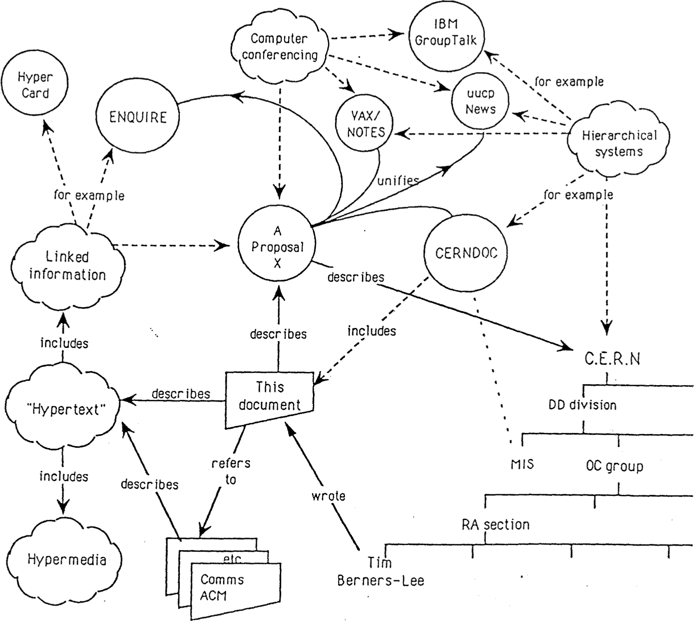
<figcaption>

The cover of the original proposal, visualizing the idea of *hypertext.* [<cite>↗</cite>](https://cds.cern.ch/record/1405411/files/ARCH-WWW-4-010.pdf)

</figcaption>
</figure>

<figure class="verso">
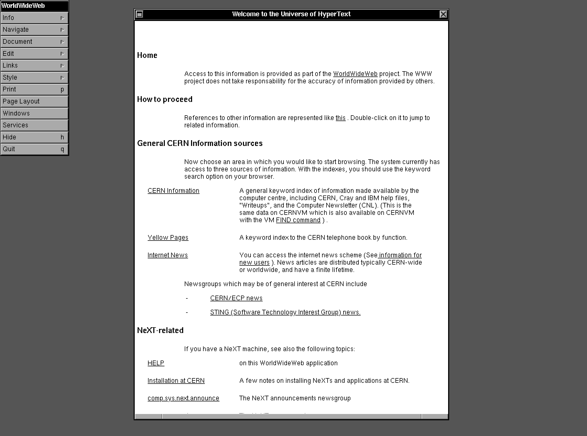
<figcaption>

How it looked for Tim, back then. [<cite>↗</cite>](https://worldwideweb.cern.ch/browser/)
</figcaption>
</figure>

<figure class="recto">
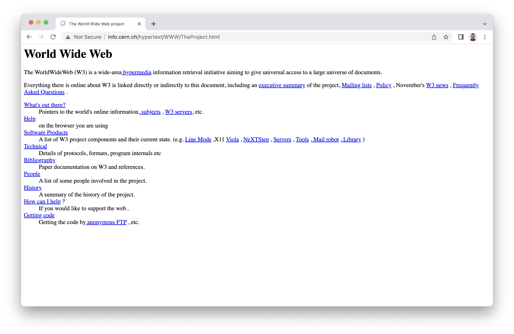
<figcaption>

How it looks for us, now. [<cite>↗</cite>](http://info.cern.ch/hypertext/WWW/TheProject.html)

</figcaption>
</figure>

**By 1991, the [first web page](http://info.cern.ch/hypertext/WWW/TheProject.html) was up and running and the web began to take off.**

<figure class="aside">
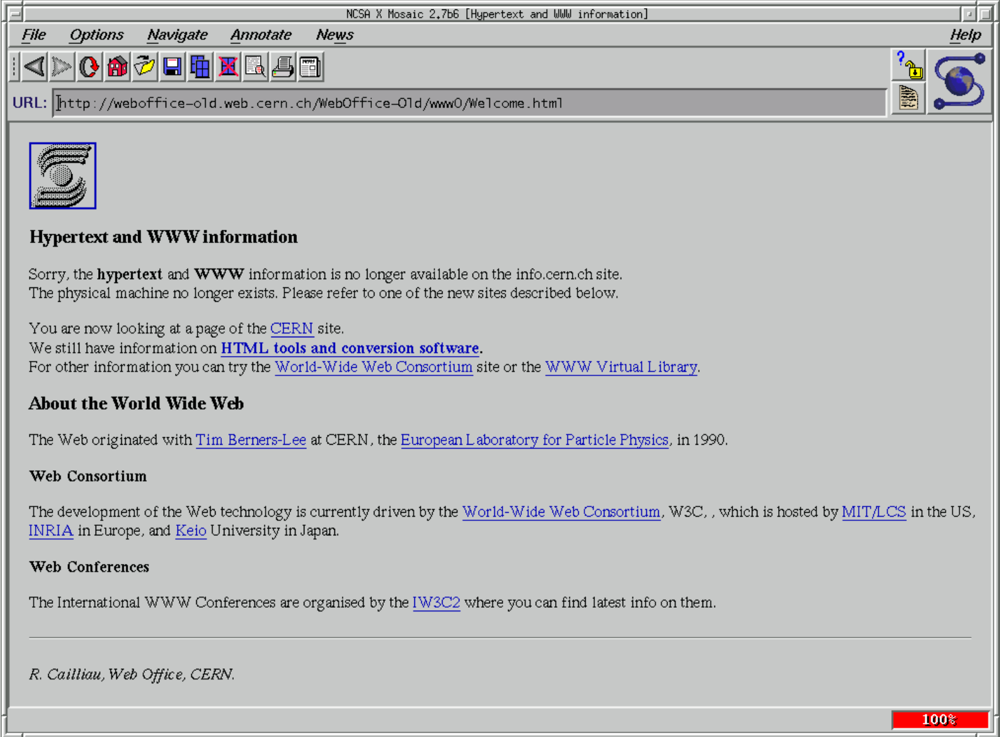
<figcaption>

Mosaic was one of the first widely-available browsers. It introduced support for *images*. [<cite>↗</cite>](https://en.wikipedia.org/wiki/Mosaic_(web_browser)#/media/File:NCSA_Mosaic_Browser_Screenshot.png)

</figcaption>
</figure>

<figure>
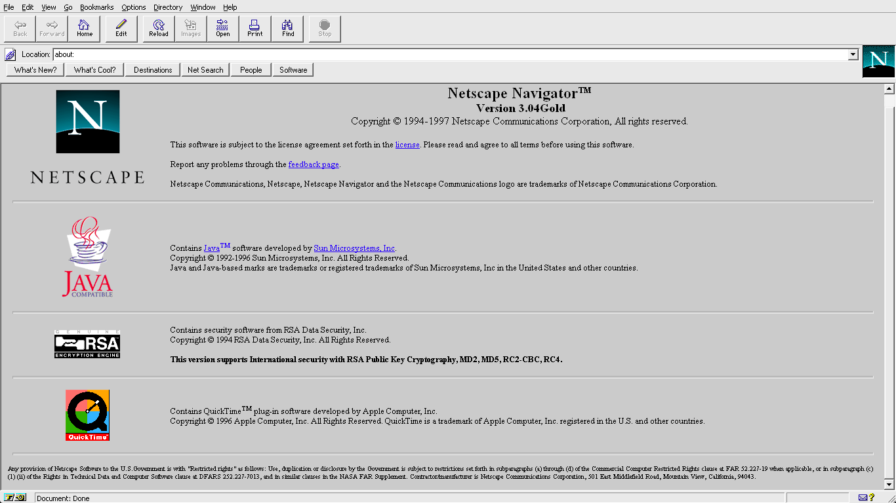
<figcaption>

Netscape, the first browser that Michael ever used. [<cite>↗</cite>](https://commons.wikimedia.org/wiki/File:Netscape_Navigator_3_Screenshot.png)

</figcaption>
</figure>

The 1990s then saw more-affordable home computers bring internet access to many more people—escaping the government (military), business, and university settings it had been siloed in before. Early web browsers like [Mosaic and Netscape](https://en.wikipedia.org/wiki/History_of_the_web_browser) (1993) helped evolve what was possible online—adding color, images, and interactivity.

**And the web exploded from there.**

<figure class="aside">
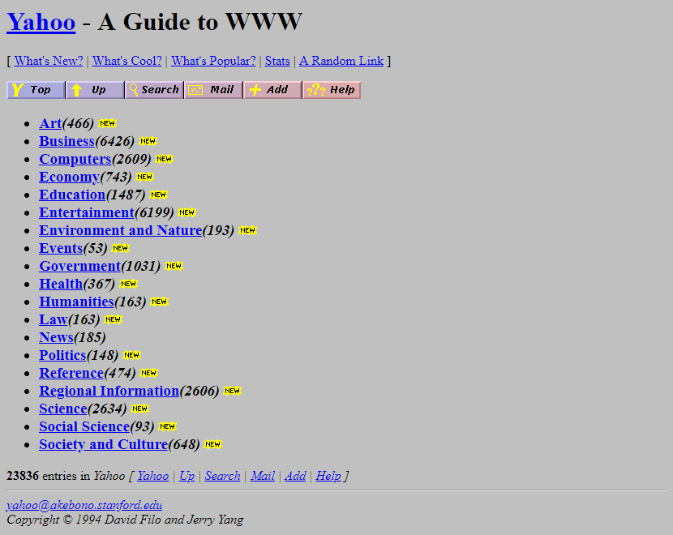
<figcaption>

1994: Before search engines, there were web directories like Yahoo. [<cite>↗</cite>](https://www.webdesignmuseum.org/gallery/yahoo-1994)

</figcaption>
</figure>

<figure class="recto">
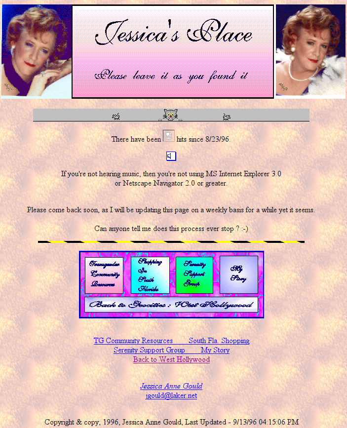
<figcaption>

1995: GeoCities brought web design to the masses, for better or for worse. [<cite>↗</cite>](https://blog.geocities.institute/archives/791)

</figcaption>
</figure>

<figure>
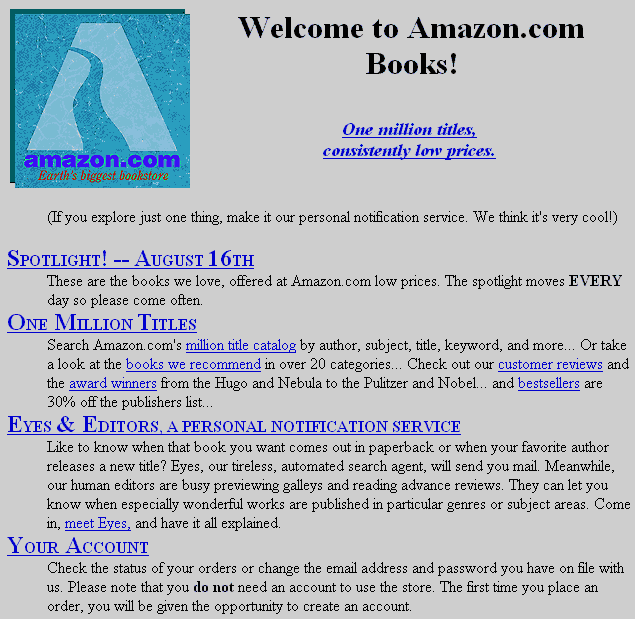
<figcaption>

1995: They used to sell books, if you can believe it. [<cite>↗</cite>](https://www.versionmuseum.com/history-of/amazon-website)

</figcaption>
</figure>

<figure class="aside">
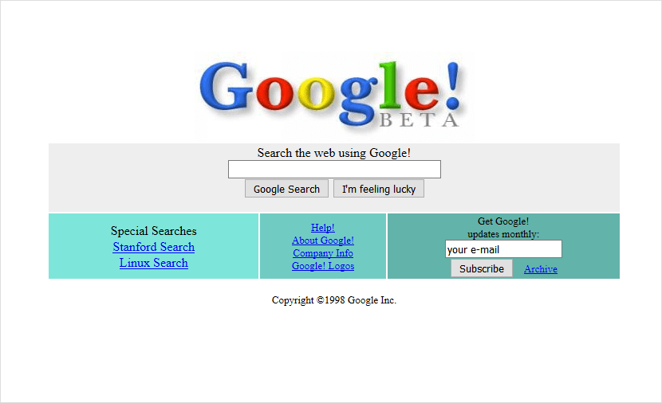
<figcaption>

1998: We eventually got search engines. [<cite>↗</cite>](https://www.webdesignmuseum.org/gallery/google-1998)

</figcaption>
</figure>

<figure class="recto">
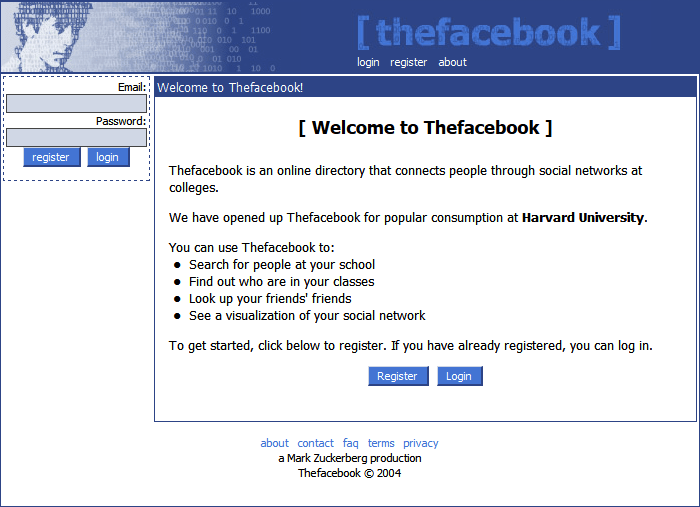
<figcaption>

2004: And then social networks. [<cite>↗</cite>](https://www.webdesignmuseum.org/gallery/google-1998)
</figcaption>
</figure>

> The dream behind the Web is of a common information space in which we communicate by sharing information.
>
> Its universality is essential: the fact that a hypertext link can point to anything, be it personal, local or global, be it draft or highly polished.
>
> [<cite>Tim Berners-Lee, 1998</cite>](https://www.scienceandmediamuseum.org.uk/objects-and-stories/short-history-internet)

## So What Are Web Pages?

<div class="body start">

<div class="sticky">

**Obviously, *this* is a web page. Think about how many other web pages you have visited in the past day. Dozens, even hundreds?**

Ultimately, a web page is a just text file on a computer. It is written in a special format, the aforementioned HTML, which structures the content of the document and also links it to other resources—other web pages, images, computers, really almost anything. Think of the web as *type with instructions*.

These all started as simple, hand-typed documents. Then as the power of computers grew, and the languages of the web evolved alongside—web pages expanded almost inconceivably in complexity and capabilities. *Cascading Style Sheets* (CSS) gave them marvelous abilities to be customized and designed. *JavaScript* (JS) gave them remarkable, newfound interactivity and function. Websites (collections of web pages) today are built on top of an incredible *stack* of technology—networks, servers, databases, libraries, browsers, devices.

</div>

</div>

<figure class="right">

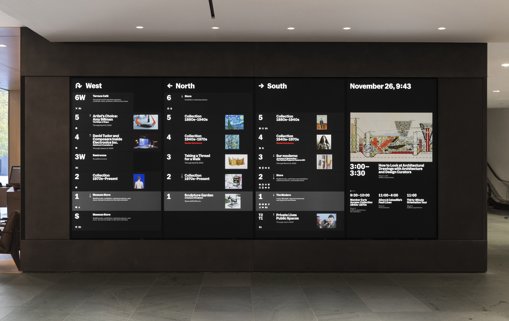


<figcaption>

Michael used to work at MoMA. These are all web pages!

</figcaption>
</figure>

**It *all* starts with text, and thus, with type.**

## An Ever-Present Visual Medium

If you’re looking at a glowing, 16:9 rectangle somewhere (and it isn’t just playing video), nowadays it is very likely a web page—built with the exact same HTML, CSS, and JS–web technologies—that are behind this page, and every other.

In its openness, connectedness, and ubiquity, the web has come to dominate over other forms of technology. Its advantages in compatibility, cost, scale, and inertia are continuing to snowball, and the advance of these web technologies shows no sign of slowing down. It is the water that we are swimming in, both as humans and as designers.

And in that latter role, we’ll need to learn how to swim. Our path into *design* then is to understand how these things are made and how they function. Their technological construction both empowers and constrains our work. You can’t separate the design from this foundation; the medium is inextricable from the end product.

> Most people make the mistake of thinking design is what it looks like. People think it’s this veneer—that the designers are handed this box and told, “Make it look good!”
>
> That’s not what we think design is. It’s not just what it looks like and feels like. Design is how it works.
>
> [<cite>Steve Jobs, 2003</cite>](https://www.nytimes.com/2003/11/30/magazine/the-guts-of-a-new-machine.html)

### These Days, Apps Are Often Web Pages Too

<figure>

<figcaption>

We’ll be using a couple of these.

</figcaption>
</figure>

All these desktop “apps” are built in [Electron](https://www.electronjs.org)—and so are really just web pages inside a slim, platform-native wrapper. (Essentially, a single-website browser!)

The core application only has to be written once, instead of rewritten for each platform. And why design it all again? (Designers are expensive!) Why hire Windows and Mac devs when you can just hire web devs? …then why hire i&NoBreak;OS or Android devs, either? (Developers are even more expensive!) So many companies take approach, for cross-platform development.

<figure>

<figcaption>

These mobile “apps” are all built with [React Native](https://reactnative.dev), following a similar paradigm.

</figcaption>
</figure>

**The app is really just a *web view* (browser), and every screen within is a *web page*.**

### It’s Increasingly Just JS, Behind the Scenes

JavaScript began as a client-side (on your computer), front-end language running in the browser. But now with runtime environments like [Node.js](https://nodejs.org/en/), [Deno](https://deno.land), and [Bun](https://bun.sh/), JS has moved to server-side (on the remote computer) functionality previously dominated by scripting languages like [ASP](https://dotnet.microsoft.com/en-us/learn/aspnet/what-is-aspnet), [Perl](https://www.perl.org), [PHP](https://www.php.net), and [Ruby](https://www.ruby-lang.org/en/).

This means that JavaScript doesn’t just run *in* a webpage you’re looking at–it often now actually *builds* the page itself. It might even send you the *packets*. More and more, JS isn’t a *part* of the stack so much as it really *is* the stack.

This “JavaScript everywhere” movement means that the tendrils of the web can encompass many non-web-page uses. Maybe it is in an app, maybe a headless data API, maybe a [hardware integration](https://www.theverge.com/2022/8/18/23206110/james-webb-space-telescope-javascript-jwst-instrument-control), maybe it is even something entirely *offline*—but it is still web technologies, most of the way down.

<!-- <mark>Only resort to JS when necessary</mark> -->

> [!TIP]
>
> Even [this very course site](https://github.com/typography-interaction-2627/typography-interaction-2627.github.io) is (mostly) static HTML/text and CSS—but it is compiled [using JavaScript](https://www.11ty.dev)!

### Even Things That Aren’t Web Pages Are Web-Page-Like

In the coming year we are going to dive properly into HTML, CSS, and JS–the *fabric* of web pages.

Let’s try to also think of these—more conceptually and semantically—as *content*, *form*, and *function*. (Or in another way, *skeleton*, *skin*, and *muscles.*) This ordering or *layering* of responsibilities is often called *progressive enhancement*. The semantic content (HTML) forms the foundation on which you can layer the form (CSS) and enhance the functionality (JS).

With this understanding, the same model exists in nearly all software. (For example, [*Resources*, *Views*, and *States*](https://developer.apple.com/tutorials/app-dev-training/#swiftui-essentials) in Mac/i&NoBreak;OS development, though the lines are being blurred.) So we can say that software that hasn’t yet been eaten by web technologies is often still *web-like*, and can be understood similarly. And the web is likely coming for them, eventually!

## Our Lens

Learning good, effective design in any medium necessitates knowing it thoroughly and completely, and we’re going strive to do that by truly understanding the web. It is fundamentally a medium of text, and thus a medium of typography—and this semester we will use that as our lens.
<!-- data-description -->

In your careers the software, languages, methodologies, and platforms might be different, and to some extent, are <nobr>ever-changing</nobr>—but the design ideas and considerations are analogous and universal. To understand design for the web is to understand interactive design. And in our lives today, to understand interactive design is to understand all design.

> All I know is that if you are a fish, it is hard to describe water, much less to ask if water is necessary, ethical, and structured the way it ought to be.
>
> [<cite>Abigail Disney, 2021</cite>](https://www.theatlantic.com/ideas/archive/2021/06/abigail-disney-rich-protect-dynastic-wealth-propublica-tax/619212/)

---

<sub>A hat-tip to friend-of-the-program [Tuan](https://tuanpham.info) on this lecture.</sub>
