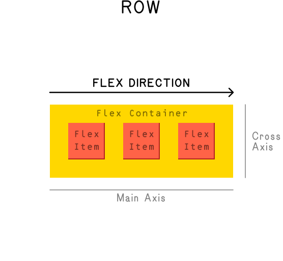
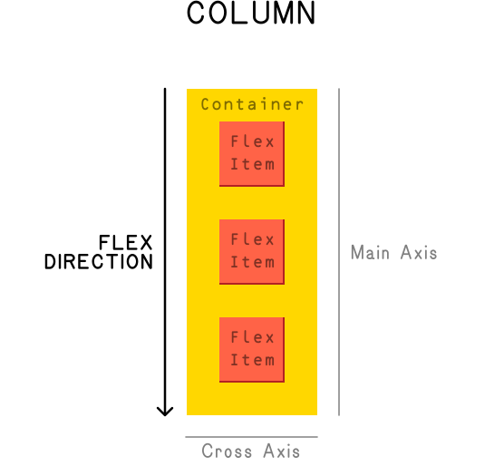
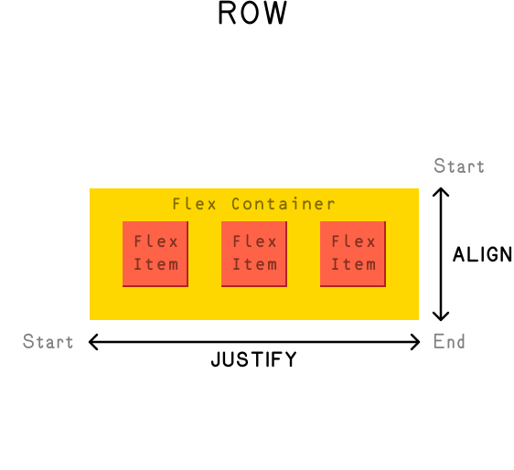
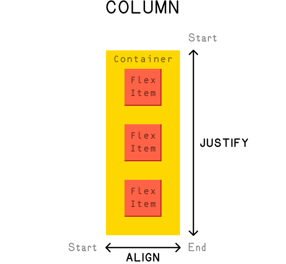

```javascript
const title = 'Finally, Flexbox'
const week = 8
const order = 1
const draft = true
```

# Finally, Flexbox

## A Long Time Coming

[*Flexbox*](https://developer.mozilla.org/en-US/docs/Learn/CSS/CSS_layout/Flexbox), short for *flexible boxes*—which folks will often just shorten all the way to *flex*—is a later (mid-2010s, [slow adoption](https://annairish.github.io/historicizing/history)) addition to CSS.

- [<cite>CSS Flexbox Layout Guide – CSS Tricks</cite>](https://css-tricks.com/snippets/css/a-guide-to-flexbox/)
	This page is a classic! It probably bought [Chris Coyier](https://chriscoyier.net) a house.

- [<cite>Basic Concepts of Flexbox – MDN</cite>](https://developer.mozilla.org/en-US/docs/Web/CSS/CSS_Flexible_Box_Layout/Basic_Concepts_of_Flexbox)
	Can’t go wrong.

- [<cite>Flexbox Froggy</cite>](https://flexboxfroggy.com/)
	A little game.
<!-- .right .rows--4 -->

*Flex* was created to facilitate and allow CSS layouts that [*the box model*](/topic/box-model/) (despite its `float` and `position`) either made difficult, brittle, or even impossible. It is a *[display](/topic/box-model/#display)* property. It’s extremely useful and widely-used.

And let us tell you—being a web designer was [a *whole lot harder*](http://meyerweb.com/eric/thoughts/2009/02/17/wanted-layout-system/) before flex came on the front-end scene. (Hence the “Finally.”) Notice, for instance, that we haven’t talked about any *vertical* centering at all yet—you don’t want to know! And you don’t have to worry about it. Flex encapsulates a lot of practical, helpful design paradigms in its system.

> I was told that the “flexbox” model would solve the problems, but there hasn't been any progress on that front these past few years…
>
> [<cite>Elika J. Etemad (Fantasai), 2007</cite>](https://lists.w3.org/Archives/Public/www-style/2007Feb/0137.html)

## Main and Cross Axes

Flexbox is a *one-dimensional* layout system—meaning it is (*…usually*) focused on arranging items either horizontally in rows, or vertically in columns.

**These are called the *axes*.**

**The one running in the direction of your flex items is your *main axis*; perpendicular to this is your *cross axis*:**

<div class="before--2 verso">

<figure>

</figure>

```css <!-- .before--0 style="inline-size: 100%" -->
.some-container {
	display: flex;
	flex-direction: row; /* Default! */
}
```

</div>

<div class="before--2 recto">

<figure>

</figure>

```css <!-- .before--0 style="inline-size: 100%" -->
.some-container {
	display: flex;
	flex-direction: column; /* Rotated! */
}
```

</div>

## Start/End, Justify/Align

Flex also lets us position elements along/within the axes, in both directions—in relation to the `start` or the `end` of the direction.
<!-- .balance -->

**For the *main* axis, you `justify`; for the *cross* axis, you `align`:**

<div class="before--2 verso">

<figure>

</figure>

```css <!-- .before--0 style="inline-size: 100%" -->
.some-container {
	display: flex;
	flex-direction: row; /* Default! */
}
```

<sub>For rows (the default): `justify` moves items inline (left/right); `align` moves block (top/bottom).</sub>

</div>

<div class="before--2 recto">

<figure>

</figure>

```css <!-- .before--0 style="inline-size: 100%" -->
.some-container {
	display: flex;
	flex-direction: column; /* Rotated! */
}
```

<sub>For columns (rotated): `justify` moves items block (top/bottom); `align` moves inline (left/right).</sub>

</div>

### Shorthand

Like a lot of CSS, *flex* has [shorthand](https://developer.mozilla.org/en-US/docs/Web/CSS/flex) [properties](https://developer.mozilla.org/en-US/docs/Web/CSS/flex-flow).

But again, we would avoid them—the system can be hard enough to understand. This will be true when we get to `grid` as well—often being a little bit more verbose in your code will make things easier to understand, especially starting out.
<!-- .balance -->

## Container (Parent) Properties

Unlike most (…all?) of the CSS we’ve been introduced to, *flex* is applied on a *parent* element—but actually adjusts the layout of the *children*. An element with `display: flex;` is really telling you what its kids are going to be doing.
<!-- .balance -->

<sub>There is also `display: inline-flex;` which behaves the same, but the parent behaves as an `inline` element while its children are flexing. You don’t see it used very much.</sub>

<aside>

<mark>Design tools offer approximations</mark>

Figma’s *[auto layout](https://help.figma.com/hc/en-us/articles/360040451373-Explore-auto-layout-properties)* system maps [almost directly](https://medium.com/timeless/figmas-flexbox-cdebb6968c29) to flexbox, in defining rows or columns and then distributing items—and is likewise applied on the parent/container.

</aside>

### `flex-direction`

After specifying an element as *flex*, we can set its main axis with the `flex-direction` property. By default (you don’t have to write it), this behaves as `flex-direction: row;`—so you’ll generally only be adding it when you want something going vertical, with `flex-direction: column;`:

[<cite>`flex-direction` – MDN</cite>](https://developer.mozilla.org/en-US/docs/Web/CSS/flex-direction)
	Always `row` by default.
<!-- .right -->

<figure style="--lines: 15">

***[`flex-direction` Example](direction/style.css)***

<figcaption>

The first list is `display: block;` by default. Also note that we gave them all a `min-block-size`, to show `start`/`end`!

</figcaption>
</figure>

You can also combine these with a `-reverse` suffix, which visually reorders the items along the *main axis*, flipping the `start` and `end`:
<!-- .balance -->

<figure style="--lines: 12">

***[`flex-direction` `reverse` Example](direction-reverse/style.css)***

</figure>

Keep in mind that all flex reordering is only *visual*—it obviously can’t change the order in your HTML. This means that keyboard navigation and screen readers still sequence through the items as they are in your code. So for good, logical accessibility, keep in mind the semantic reading order!

### `flex-wrap`

Since flexbox is *one-dimensional*, by default it will try to cram everything into one line—even when there is not enough room! But you can tell it to *wrap* onto additional lines by adding the `flex-wrap: wrap;` property/value (set to `nowrap` by default):
<!-- .balance -->

[<cite>`flex-wrap` – MDN</cite>](https://developer.mozilla.org/en-US/docs/Web/CSS/flex-wrap)
	The only *two-dimensional* flex use.
<!-- .right -->

<figure style="--lines: 22">

***[`flex-wrap` Example](wrap/style.css)***

<figcaption>

Without the height restriction, the last one would just grow taller, by default.

</figcaption>
</figure>

<aside>

<mark>If you want to make a grid, use (CSS) grid</mark>

You *can* use this to make grids, and it is sometimes sufficient. But but [the more recent CSS Grid](/topic/grid/) properties will give you more control! We’ll talk about `grid` shortly!

</aside>

There is also a `-reverse` suffix when wrapping, which will sequence items from `end` to `start`:
<!-- .balance .before--3 -->

<figure style="--lines: 22">

***[`flex-wrap` `reverse` Example](wrap-reverse/style.css)***

<figcaption>

You could do some weird, unique layouts with these—but keep in mind the order is still only *visual*!

</figcaption>
</figure>

### `justify-content`

So most of what we’ve seen here is… somewhat possible using `float` and `position`—though not at all easily and only when you know the size/counts of your content.

[<cite>`justify-content` – MDN</cite>](https://developer.mozilla.org/en-US/docs/Web/CSS/justify-content)
	How should we space items out?
<!-- .right -->

But the `justify-content` property is where flexbox starts to allow novel layouts, by dividing up the extra/available free space between elements—akin to *distribute* options in Figma/Adobe applications. `justify-content` does this on our *main axis*:

<figure style="--lines: 15">

***[`justify-content` Example](justify-content/style.css)***

<figcaption>

The `start`/`end` values [have some nuance](https://csslayout.news/whats-the-difference-between-the-alignment-values-of-start-flex-start-and-self-start/) with different writing directions, but this doesn’t come up often.

</figcaption>
</figure>

When our *main axis* is vertical, with `flex-direction: column;`:

<figure style="--lines: 21">

***[`justify-content` `column` Example](justify-content-column/style.css)***

<figcaption>

These only works with the `block-size` to *justify* within—otherwise the container would cinch up to the content height, as usual.

</figcaption>
</figure>

### `align-items`

And then perpendicular to `justify` along the *main axis*, flexbox has the `align-items` property to position elements along the *cross axis*. It has similar values:
<!-- .balance -->

[<cite>`align-items` – MDN</cite>](https://developer.mozilla.org/en-US/docs/Web/CSS/align-items)
	For the cross/perpendicular axis.
<!-- .right -->

<figure style="--lines: 25">

***[`align-items` Example](align-items/style.css)***

</figure>

And for the vertical:

<figure style="--lines: 22">

***[`align-items` `column` Example](align-items-column/style.css)***

</figure>

### `align-content`

When we have a flex element with `flex-wrap` set, we can also position the *lines* within the parent/container with the `align-content` property—akin to `justify-content` with each line:
<!-- .balance -->

[<cite>`align-content` – MDN</cite>](https://developer.mozilla.org/en-US/docs/Web/CSS/align-content)
	When there is extra room.
<!-- .right -->

<figure style="--lines: 21">

***[`align-content` Example](align-content/style.css)***

<figcaption>

These wouldn’t do anything without the `block-size` and the `flex-wrap`.

</figcaption>
</figure>

<sub>`align-content` can also be used with a vertical/`flex-direction: column;` axis, not shown here. This doesn’t often come up, as you have to specify/know a height to force a column wrap.</sub>

### `gap` / `row-gap` / `column-gap`

While you could use *margin* to separate your flex children, it would apply to the items on the outer edges, too. (Hence our many `:not(:first-child)` selectors for `margin` in the examples, so far.)
<!-- .balance -->

- [<cite>`gap` – MDN</cite>](https://developer.mozilla.org/en-US/docs/Web/CSS/gap)
- [<cite>`row-gap` – MDN</cite>](https://developer.mozilla.org/en-US/docs/Web/CSS/row-gap)
- [<cite>`column-gap` – MDN</cite>](https://developer.mozilla.org/en-US/docs/Web/CSS/column-gap)
	These are common with [CSS grid](/topic/grid/#gap-column-gap-row-gap)!
<!-- .right .rows--2 -->

Flex added support for intuitive [`gap` properties](https://developer.mozilla.org/en-US/docs/Web/CSS/gap), which fix this problem—by applying spacing only *between* children. This is particularly helpful with dynamic, wrapping content and responsive designs—where you won’t always know which element ends or starts a line (to take their margin off):

<figure style="--lines: 25">

***[`gap` Example](gap/style.css)***

<figcaption>

Note the last one, `gap` are really *minimums* and only apply when there isn’t otherwise space.

</figcaption>
</figure>

<aside>

<mark>`flex` and `grid` share vocabulary</mark>

Note that the `justify`, `align`, and `gap` properties are also shared (in name and behavior) with [CSS Grid](/topic/grid/), up next!

</aside>

>If we did a Flexbox spec workshop, where we went over the whole spec in excruciating detail and sketched illustrations, who would come?
>
> [<cite>Fantasai again, 2015</cite>](https://fantasai.inkedblade.net/style/events/flexbox-workshop)

## Item (Child) Properties

Flexbox is *usually* applied on the parent/container. But once you’ve set `display: flex;` on an element, there are also some individual override properties that can be given to its children, *flex items*.

### `order`

Kind of like the `-reverse` suffix—you can individually apply the `order` property to a *flex item* (child). Items with the same/tied order (like everything with the default of `order: 0;`) will be displayed in their HTML/source order:
<!-- .balance -->

[<cite>`order` – MDN</cite>](https://developer.mozilla.org/en-US/docs/Web/CSS/order)
	Visual/display only!
<!-- .right -->

<figure style="--lines: 25">

***[`order` Example](order/style.css)***

</figure>

Other order-based selectors (like `:first-child`) won’t be fooled by this reordering—as you can see, we used them here. They still use the HTML/DOM order. And again, this change is only *visual*—so don’t use it when screen reader/content sequence accessibility is a concern!

### `flex-grow` / `flex-shrink`

These properties tell the flex items to… `grow` or `shrink`, if necessary—defining the amount of available/remaining space in the container an element should take up—filling the whole container, like [bento boxes](https://en.wikipedia.org/wiki/Bento).

- [<cite>`flex-grow` – MDN</cite>](https://developer.mozilla.org/en-US/docs/Web/CSS/flex-grow)
- [<cite>`flex-shrink` – MDN</cite>](https://developer.mozilla.org/en-US/docs/Web/CSS/flex-shrink)
	Who takes up the extra space?
<!-- .right .rows--2 -->

It takes a *unitless* proportional value, akin to fractions or a factor/multiplier. If you give one flexed child `flex-grow: 1;` it will take up all the extra space; another element with `flex-grow: 2;` would then take twice as much of that space as the first one (the available space with 3 total units):

<figure style="--lines: 25">

***[`flex-grow`/`flex-shrink` Example](grow-shrink/style.css)***

</figure>

And `flex-shrink` works the same way—defining what proportion an element should shrink when forced to by the flex layout. The most use you’ll see of this is `flex-shrink: 0;`, which tells all the *other* items to shrink instead!
<!-- .balance -->

### `flex-basis`

The `flex-basis` property is a little like `inline-size` and `block-size`—depending on your *main axis*. It defines what the child item’s content box size should be *before* any remaining space is distributed.
<!-- .balance -->

[<cite>`flex-basis` – MDN</cite>](https://developer.mozilla.org/en-US/docs/Web/CSS/flex-basis)
	How much of the space.
<!-- .right -->

This defaults to `auto`, which falls back to any specified `inline-size` or `block-size`—and if those aren’t present, will just use the size of the content. You specify this `flex-basis` with [length units](/topic/box-model/#and-their-units) like `%` and `px` :
<!-- .balance -->

<figure style="--lines: 14">

***[`flex-basis` Example](basis/style.css)***

<figcaption>

You are [usually fine](https://stackoverflow.com/a/34355447) just specifying `inline-size` / `block-size`.

</figcaption>
</figure>

### `align-self`

Finally, we have an individual override for an [`align-items`](#align-items) property set on the parent—the `align-self` property—which adjusts (with the same keywords/values) the alignment of the *specific* child item it is applied to:

[<cite>`align-self` – MDN</cite>](https://developer.mozilla.org/en-US/docs/Web/CSS/align-self)
	Overrides this child! Rebels.
<!-- .right -->

<figure style="--lines: 25">

***[`align-self` Example](align-self/style.css)***

</figure>

This is a lot of stuff! Flex can sometimes be tough to wrap one’s head around, but it is *so much better* than `float` and `inline-size` and `margin` shenanigans.
<!-- .balance -->

**Much of what you look at on the web is laid out in flexbox (and its followup which we keep mentioning, [CSS Grid](/topic/grid/)).**

> Flexbox is a new layout model for CSS.
>
> The contents of a flex container can be laid out in any direction, can be reordered, can be aligned and justified within their container, and can “flex”their sizes and positions to respond to the available space.
>
> We expect this model to be particularly useful for UI layouts.
>
> [<cite>Fantasai, finally, 2017</cite>](https://lists.w3.org/Archives/Public/www-style/2017Dec/0057.html)
