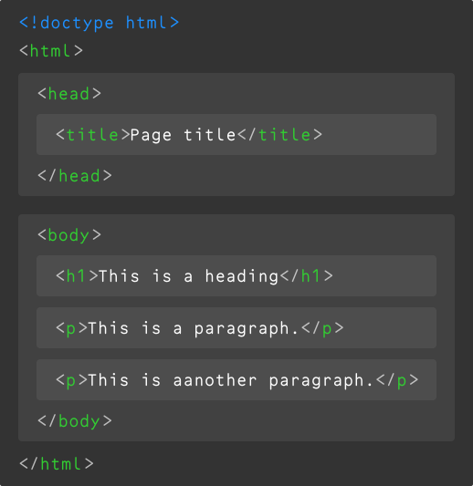

```javascript
const week = 3
```

# An Intro to HTML

## First, Why Do We Care?

In 2026, with LLM&NoBreak;s and the world on fire—what does HTML have to offer for us? What can we learn from it?

<details>
<summary>

Why should a designer care about HTML?

</summary>

- **It helps teach us to structure our thinking into organized *systems.***

- **Separating the *meaning* (semantics) of content from its visual display encourages flexibility and iteration.**

- **Links ([hypermedia](https://en.wikipedia.org/wiki/Hypermedia)) are the very foundation of interactive design.**

- **It is the [underlying fabric](../everything/index.md) of much of our digital lives.**

- **It’s easy to learn, and a gateway to other programming languages.**

- **It’s (probably) older than you, and shows no signs of going anywhere.**

- **Nobody can “acquire” it!**
<!-- .balance -->

</details>

## HTML Stands for *HyperText Markup Language*

HTML is the standard markup language/format for creating web pages, containing the content and structure of a page as a series of *elements*.

- [<cite>HTML – MDN</cite>](https://developer.mozilla.org/en-US/docs/Web/HTML) \
	When in doubt, refer to the MDN documentation!

- [<cite>Basics of HTML</cite>](https://www.youtube.com/watch?v=CkzbI1Tv_rQ)\
	A very calming introduction by [Laurel Schwulst](https://laurelschwulst.com).

- [<cite>Organizing Files for the Web</cite>](https://docs.google.com/presentation/d/101TEdtacOFZhCwebijcJaX0h1BpDwhAm2SJhE3jW89c/edit#slide=id.g331f24f572_4_0)
	[Sasha Portis](https://sashaportis.com) on (web) file-naming, for when you get to saving.
<!-- .right .rows--4 -->

In our ongoing analogy, HTML is the _skeleton_ of the web. At its most basic it is a text file, in a folder on a computer, with a `.html` extension—*text, with instructions.*

As we heard in our first class, this format was codified by our pal [Tim Berners-Lee](https://www.w3.org/People/Berners-Lee/) in 1991, evolving from his earlier [SGML](https://en.wikipedia.org/wiki/Standard_Generalized_Markup_Language), a similar/proto language. There have been five major revisions to the spec since then, which added (and sometimes _deprecated_, or removed) tags and syntax:

- HTML 1, 1991
- HTML 2, 1995
- HTML 3, 1997
- HTML 4, 1997 (busy year)
- HTML 5, 2014 (ongoing)

## The Basic Document

<figure class="verso center">

</figure>

<div class="center recto">

HTML consists of a [range of elements](https://developer.mozilla.org/en-US/docs/Web/HTML/Element), nested inside one another, like a [matryoshka doll](https://en.wikipedia.org/wiki/Matryoshka_doll) of text.

The `<html>` element contains all elements of the page. In diagram here, the `<head>` element contains the `<title>`, and the `<body>` contains the `<h1>` and `<p>` elements.

We call these [*semantic* elements](https://developer.mozilla.org/en-US/docs/Glossary/Semantics#semantic_elements)—which is saying that they give their contents a *meaning* or a *role*. (Remember [Tim’s diagram](/topic/everything/web.png).) These *roles* are then interpreted by your browser (Chrome, Safari, Firefox, etc.) when it loads the file, to ultimately display the page. We call this *parsing* the document.

</div>

> *The Semantic Web* is not a separate Web but an extension of the current one, in which information is given well-defined meaning, better enabling computers and people to work in cooperation.
>
>
> [<cite>Tim Berners-Lee, 2001</cite>](https://www.lassila.org/publications/2001/SciAm.pdf)

### What Does That Even Mean

<div class="verso">

```html <!-- .sticky -->
<!doctype html>
<html>
	<head>
		<title>Page title</title>
	</head>
	<body>
		<h1>This is a heading</h1>
		<p>This is a paragraph.</p>
		<p>This is another paragraph.</p>
	</body>
</html>
```

</div>

<div class="recto before--1">

**In our example, here is what we’ve told the computer:**

- `<!doctype html>`

	What type/version of HTML this file contains, so it knows how to parse it.

	- `<html></html>`

		The root element of an HTML page, containing all the content.

	- `<head></head>`

		The *meta* information about the HTML page—like its title, default language, and any [scripts](https://developer.mozilla.org/en-US/docs/Web/HTML/Element/script) and [stylesheets](https://developer.mozilla.org/en-US/docs/Web/HTML/Element/style) it needs to display the page.

		<sub>Nothing in this element is visible on the page itself!</sub>

		- `<title></title>`

			Specifies a [title](https://developer.mozilla.org/en-US/docs/Web/HTML/Element/title) for the page—which is shown in the browser’s tab, and when it is shared.

	- `<body></body>`

		 Defines the document's body—the container for all the visible contents, such as headings, paragraphs, images, hyperlinks, tables, lists, etc.

		- `<h1></h1>`

			Defines a primary/first-level heading.

		- `<p></p>`

			Defines a paragraph.

</div>

We use semantic elements to help structure and describe our content—but also for accessibility (screen readers)—where the tag type helps indicate what things *are*.
<!-- .before -->

And as designers—they also help us to organize our systems, and give us hooks for styling (later, in CSS)!

## What Are Elements?

**[Elements](https://developer.mozilla.org/en-US/docs/Glossary/Element) are composed of *tags* and their content:**

[<cite>HTML Elements Reference – MDN</cite>](https://developer.mozilla.org/en-US/docs/Web/HTML/Element)
	MDN will always go deep; this is *all* the elements.
<!-- .right -->

<figure class="borderless">

<figcaption>

Some elements do not have any content or children, like `<br>` or ``. These are called [*empty elements*](https://developer.mozilla.org/en-US/docs/Glossary/Empty_element), and do not have a closing tag.

</figcaption>
</figure>

<dl>

<dt id="headings">

Headings: `h#`

</dt>
<dd>

```html <!-- .all -->
<h1>There should only be one first-level heading!</h1>
```

There are also `<h2>` `<h3>` `<h4>` `<h5>` and `<h6>`. These provide semantic organization and hierarchy for your document!

</dd>

<dt id="paragraphs">

Paragraphs: `<p>`

</dt>
<dd>

```html <!-- .all -->
<p>You should always wrap your text in a paragraph!</p>
```

Our basic, default text element, whether short or long.

</dd>

<dt id="links">

Links: `<a>`

</dt>
<dd>

```html <!-- .all -->
<a href="https://www.example.com">Links need attributes!</a>
```

The `<a>` is for [*anchor*](https://www.w3.org/TR/html4/struct/links.html#h-12.1)—one *end* of the link.

The `href=` (*H*ypertext *REF*erence) specifies a URL that the link points to, and the tag wraps the visible link text. This *attribute* can point to another, local HTML file (living in the same directory structure) or an external page. They can also point to specific parts of a page.

</dd>

<dt id="buttons">

Buttons: `<button>`

</dt>
<dd>

```html <!-- .all -->
<button>Close</button>
```

Differing slightly from links, `<button>` are used for other, non-navigation interactions. These won’t do [much](#popovers) for us until JS, though!

</dd>

<dt id="images">

Images: ``

</dt>
<dd>

```html <!-- .all -->

```

The `src` likewise can point to a local image file or an external URL! `alt` provides a description for accessibility/screen readers. More on these *attributes* in a bit.

</dd>

<dt id="containers">

Containers

</dt>

<dd>

```html <!-- .all -->
<body>
	<header>
		<!-- A header. -->
	</header>
	<main>
		<!-- Your main content. -->
	</main>
	<footer>
		<!-- The footer. -->
	</footer>
</body>
```

Some others are `<nav>`, `<article>`, `<section>`, and `<div>` (when nothing else is more appropriate).

These are the structural containers of a website. The names don’t imbue function directly, but help us organize and think about our content structure—and also are helpful for accessibility.

<dt id="inline">

Inline Text Elements

</dt>
<dd>

```html <!-- .all -->
<p>You <strong>may</strong> notice I like using<em>emphasis</em>.</p>
```

These wrap around bits of text (within [headings](#headings) or `<p>`) for semantic meaning and to apply specific styles using `<span>`, `<strong>`, `<em>`, `<abbr>`, `<cite>`, `<time>`, `<code>`, `<mark>`, `<del>`, `<ins>`, `<sub>`, and `<sup>`.

<dt id="list">

Lists: `ol` / `<ul>`

</dt>
<dd>

```html <!-- .all -->
<ul>
	<li><!-- A list item. --></li>
	<li><!-- Another. --></li>
	<li><!-- A third. --></li>
</ul>
```

If you have three of something, it is probably [a list](#lists)! There are also `ol`, when the *order* matters.

</dl>

**There are [many, many HTML elements](https://developer.mozilla.org/en-US/docs/Web/HTML/Element), all with particular uses. (We’ll unpack some more, later.)**

## Attributes

**All HTML elements can have [attributes](https://developer.mozilla.org/en-US/docs/Web/HTML/Attributes), which provide more information about the element:**

[<cite>HTML Attribute Reference – MDN</cite>](https://developer.mozilla.org/en-US/docs/Web/HTML/Attributes)
	There are a lot of them.
<!-- .right -->

<figure class="borderless">

</figure>

### Common Attributes

<dl>

<dt id="language">

Language: `lang`

</dt>
<dd>

```html <!-- .all -->
<html lang="en"></html>
```

The `lang` attribute of the `<html>` tag declares the language of the Web page.

</dd>

<dt id="href">

HyperText Reference: `href`

</dt>
<dd>

```html <!-- .all -->
<a href="https://www.example.com">Goes to example.com</a>
```

The `href` attribute of `<a>` specifies the URL of the page, email address, or anchor the link goes to.

</dd>

<dt id="target">

Target: `target`

</dt>
<dd>

```html <!-- .all -->
<a href="https://www.example.com" target="_blank">New tab!</a>
```

The `target` attribute `_blank` can tell an `<a>` to open in a new window/tab.

<sub>This can be pretty annoying, so use it judiciously!</sub>

</dd>

<dt id="style">

Style: `style`

</dt>
<dd>

```html <!-- .all -->
<p style="color: blue;">This is blue text.</p>
```

The `style` attribute is used to add styles to an element, such as color, font, size, etc.

<sub>We’ll use CSS for this kind of thing, but know this is how it used to be done and it was brittle and terrible!</sub>
</dd>

<dt id="src">

Source: `src`

</dt>
<dd>

```html <!-- .all -->

```

The `src` attribute of `` specifies the path to the image to be displayed—either relatively or absolutely.

```html <!-- .all -->
<iframe src="https://typography-interaction-2627.github.io"></iframe>
```

Same thing for an `<iframe>`, which is [a little window](https://developer.mozilla.org/en-US/docs/Web/HTML/Element/iframe) into another website!

</dd>

<dt id="dimensions">

Dimensions: `width` / `height`

</dt>
<dd>

```html <!-- .all -->

```

The `width` and `height` attributes of `` provide (unitless) size information for images.

<sub>Not required, but helps prevent layout “sloshing” as images load.</sub>

</dd>

<dt id="alt">

Alternate Text: `alt`

</dt>
<dd>

```html <!-- .all -->

```

The `alt` attribute of `` provides an alternate text for an image, used by screen readers.

</dd>

<dt id="id">

Identifier: `id`

</dt>
<dd>

```html <!-- .all -->
<h2 id="a-heading-element">A heading element</h2>
```

```html <!-- .all -->
<a href="#a-heading-element">Goes to “a heading element”</a>
```

The `id` specifies a singular, unique element on a page—for CSS targeting and <span id="anchor-links">anchor (*scroll*, *jump*) links</span>, prepended with `#`.

</dd>

<dt id="class">

Class: `class`

</dt>
<dd>

```html <!-- .all -->
<p class="warning">We’ll get into this soon.</p>
```

The `class` attribute provides an additional way to select the element in CSS or JS.
</dd>

</dl>

## Case, White Space, Tabs, Line Breaks

Generally speaking, HTML doesn’t care about capitalization, extra white space, or line breaks (one exception, [below](#inline-whitespace)). The browser will just read everything from left to right, as if it is one long, running sentence. So the shouty `<html>` and quieter `<html>` are interpreted the same.

[<cite>How Whitespace Is Handled – MDN</cite>](https://developer.mozilla.org/en-US/docs/Web/API/Document_Object_Model/Whitespace)
	It depends! It always depends.
<!-- .right .rows--2 -->

**The browser parses both of these in the exact same way:**

```html <!-- .verso -->
<body>
	<h1>Dog Breeds</h1>
	<p>There are many kind of dog breeds</p>
	<ul>
		<li>German Shepherd</li>
		<li>Bulldog</li>
		<li>Poodle</li>
	</ul>
</body>
```

```html <!-- .recto .center -->
<body><h1>Dog Breeds</h1><p>There
are many kind of dog breeds</p>
<ul><li>German Shepherd</li><li>
Bulldog</li><li>Poodle</li></ul>
</body>
```

But obviously, the left one here is much more readable to us humans. We can use white space, tabs/indenting, and line breaks to make it easier for us to read the code.
<!-- .before -->

There are a lot of common patterns used—like indenting to indicate hierarchy/nesting. But there are also no wrong ways to do it! In HTML, spaces are code *ergonomics* for you—just like a good chair or desk—that allow you to work more comfortably.

> Code is read more often than it is written. Code should always be written in a way that promotes readability.
>
> [<cite>Guido van Rossum, 2001</cite>](https://peps.python.org/pep-0008/)

## Block Elements

[*Block-level elements*](https://developer.mozilla.org/en-US/docs/Glossary/Block-level_content) always start on a new line, and take up the full width available—stretching out to the left and right of their parent/container. They stack on top of each other. Importantly, block elements can have a top and bottom margin, unlike inline elements.

[<cite>Block-level content – MDN</cite>](https://developer.mozilla.org/en-US/docs/Glossary/Block-level_content)
	Our larger elements, stacked up.
<!-- .right -->

<section class="nowrap" style="--leading: 1.5rlh">

`<address>`
`<article>`
`<aside>`
`<blockquote>`
`<canvas>`
<!-- .one -->

`<dd>`
`<div>`
`<dl>`
`<dt>`
`<fieldset>`
<!-- .two -->

`<figcaption>`
`<figure>`
`<footer>`
`<form>`
`<h1>`&#x202F;–&#x202F;`<h6>`
<!-- .three -->

`<header>`
`<hr>`
`<li>`
`<main>`
`<nav>`
<!-- .four -->

`<noscript>`
`<ol>`
`<p>`
`<pre>`
`<section>`
<!-- .five -->

`<table>`
`<tfoot>`
`<ul>`
<!-- .six -->

</section>

### Let’s Try It Out

<figure style="--lines: 15">

***[Block Example](block/)***

<figcaption>

These are live, *editable* examples! Whatever is on the left is rendered on the right.

</figcaption>
</figure>

## Inline Elements

[*Inline elements*](https://developer.mozilla.org/en-US/docs/Glossary/Inline-level_content) do *not* start on a new line, and only take up as much width as necessary. You can think of these as the little metal slugs [from printing](<https://en.wikipedia.org/wiki/Slug_(typesetting)>), within text. Other text and inline elements will continue to flow around them, and they can wrap to new lines:

[<cite>Inline-level content – MDN</cite>](https://developer.mozilla.org/en-US/docs/Glossary/Inline-level_content)
	Smaller, moving within our text.
<!-- .right -->

`<abbr>` `<a>` `<cite>` `<code>` `<del>` `<em>` `` `<ins>` `<mark>` `<span>` `<strong>` `<sub>` `<sup>` `<time>`
<!-- .balance style="--leading: 1.5rlh" -->

### Let’s Try These Out Too

<figure style="--lines: 13">

***[Inline Example](inline/)***

</figure>

### Inline Whitespace

Inline elements [are the exception](https://developer.mozilla.org/en-US/docs/Web/API/Document_Object_Model/Whitespace#spaces_in_between_inline_and_inline-block_elements) to the “white space is generally ignored” rule: extra space between inline elements will always be reduced—*collapsed*—to one space.
<!-- .verso -->

<div class="recto">

```html
<p>
	<span>Hello</span>
	<span>World</span>
</p>
```

<sub>…displays as `Hello World`, not  `HelloWorld`.</sub>

</div>

## So Many Elements

### Comments

You can *comment* part of the code and the browser won’t show it. [Comments](https://developer.mozilla.org/en-US/docs/Learn/HTML/Introduction_to_HTML/Getting_started#html_comments) are often used to explain your thinking, organize your code, “turn off” a bit of code, or temporarily hide whatever you’d like.

[<cite>Using HTML comments – MDN</cite>](https://developer.mozilla.org/en-US/docs/Web/HTML/Guides/Comments)
	Always. Be. Commenting.
<!-- .right -->

<figure style="--lines: 11">

***[Comment Example](comment/)***

<figcaption>

Keep in mind these are still readable in the *source*.

</figcaption>
</figure>

> [!TIP]
>
> Commenting is *highly* encouraged! If you figure something tricky out, write down why and how you solved it to help you understand and remember—you’ll often come back to these things.
>
> <sub>Commenting your code is a gift to your future self!</sub>

> [!IMPORTANT]
>
> Commenting is also how you will [add attributions](/syllabus/#attribution) to your code!

### Lists

Any time you have more than two of something, you probably have [a *list*](https://developer.mozilla.org/en-US/docs/Learn_web_development/Core/Structuring_content/Lists). These are commonly used for semantic navigation elements, as well—think *“here’s a list of links in this site”*:

[<cite>Lists – MDN</cite>](https://developer.mozilla.org/en-US/docs/Learn_web_development/Core/Structuring_content/Lists)
	Lists are everywhere!
<!-- .right -->

<figure style="--lines: 21">

***[List Example](list/)***

</figure>

### Description Lists

There are [specific lists](https://developer.mozilla.org/en-US/docs/Web/HTML/Element/dl) for defining things:

[<cite>Description list element – MDN</cite>](https://developer.mozilla.org/en-US/docs/Web/HTML/Reference/Elements/dl)
	A more-specific, underused type.
<!-- .right -->

<figure style="--lines: 16">

***[Description List Example](description-list/)***

<figcaption>

These aren’t much to look at without CSS, though. Soon!

</figcaption>
</figure>

### Tables

[*Tables*](https://developer.mozilla.org/en-US/docs/Web/HTML/Element/table) can we used to display [*tabular*](https://en.wikipedia.org/wiki/Table_(format)) data:

[<cite>Table element – MDN</cite>](https://developer.mozilla.org/en-US/docs/Web/HTML/Reference/Elements/table)
	Before everything was a `div`, it was a `table`.
<!-- .right -->

<figure style="--lines: 25">

***[Table Example](table/)***

<figcaption>

This syntax is pretty verbose, for what you get—only reach for this if it fits the information.

</figcaption>
</figure>

They used to be the only way to achieve multi-column or grid layouts, but that has luckily since been replaced by modern CSS techniques like `flexbox`, and `grid`. (Or even `float`.) We’ll talk about those later!

### Details&#x202F;/&thinsp;Summary

There is even some basic interactivity (way, way ahead of JavaScript) with [*details disclosure*](https://developer.mozilla.org/en-US/docs/Web/HTML/Element/details) elements that open and close:

[<cite>Details disclosure element – MDN</cite>](https://developer.mozilla.org/en-US/docs/Web/HTML/Reference/Elements/details)
	Some basic interactivity!
<!-- .right -->

<figure style="--lines: 18">

***[Details/Summary Example](details-summary/)***

<figcaption>

You can do a lot with these, without any JavaScript! Our navigation is built with them! Adding [the `name` attribute](https://developer.mozilla.org/en-US/docs/Web/HTML/Reference/Elements/details#name) can now make these one-at-a-time.

</figcaption>
</figure>

### Popovers

HTML continues to evolve, very recently adding native (non-JS) support for [*popovers*](https://developer.mozilla.org/en-US/docs/Web/HTML/Reference/Global_attributes/popover)—click one thing, display another! You can do this natively now:

[<cite>`popover` attribute – MDN</cite>](https://developer.mozilla.org/en-US/docs/Web/HTML/Reference/Global_attributes/popover)
	Even more flexible interactivity!
<!-- .right -->

<figure style="--lines: 18">

***[Popover Example](popover/)***

<figcaption>

No JS needed! This opens up a lot of interactive possibilities.

</figcaption>
</figure>

### Modal Dialogs

There is also a more specific kind of popover that is called a [`dialog` box](https://developer.mozilla.org/en-US/docs/Web/HTML/Reference/Elements/dialog)—which are often used for [*modal*](https://en.wikipedia.org/wiki/Modal_window) content—which interrupts your view:

[<cite>Dialog element – MDN</cite>](https://developer.mozilla.org/en-US/docs/Web/HTML/Reference/Elements/dialog)
These also used to need a fair bit of JS!
<!-- .right -->

<figure style="--lines: 18">

***[Dialog Example](dialog/)***

<figcaption>

You can also use your <kbd>Esc</kbd> key to dismiss these!

</figcaption>
</figure>

**Again, there are [many, many, many, many HTML elements](https://developer.mozilla.org/en-US/docs/Web/HTML/Element). Try and find the one that best fits your usage, wherever possible using a *semantic* element that fits your content.**

## User-Agent Styles

We haven’t applied any styles/CSS here yet, so everything we see in these examples is based on the [*user-agent* stylesheets](https://developer.mozilla.org/en-US/docs/Web/CSS/Cascade#user-agent_stylesheets)—that is, each browser’s own default display (and behavior) for an element type.

This is what the web was, before CSS! But as a designer, rarely what you want. We’ll get into writing our own styles in the coming weeks.

> In case of conflict, consider users over authors over implementors over specifiers over theoretical purity.
>
> In other words costs or difficulties to the user should be given more weight than costs to authors; which in turn should be given more weight than costs to implementors; which should be given more weight than costs to authors of the spec itself, which should be given more weight than those proposing changes for theoretical reasons alone.
>
> Of course, it is preferred to make things better for multiple constituencies at once.
>
> [<cite>W3C, HTML Design Principles, 2007</cite>](https://www.w3.org/TR/html-design-principles/#priority-of-constituencies)
