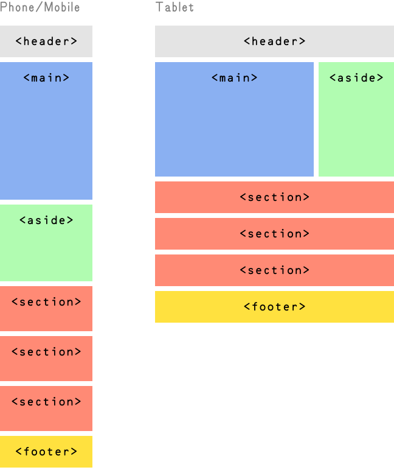
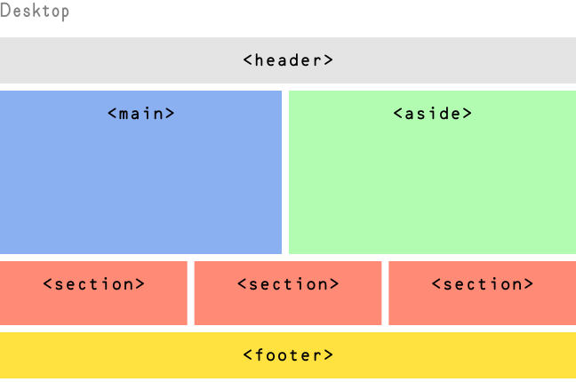
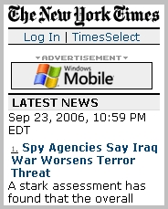
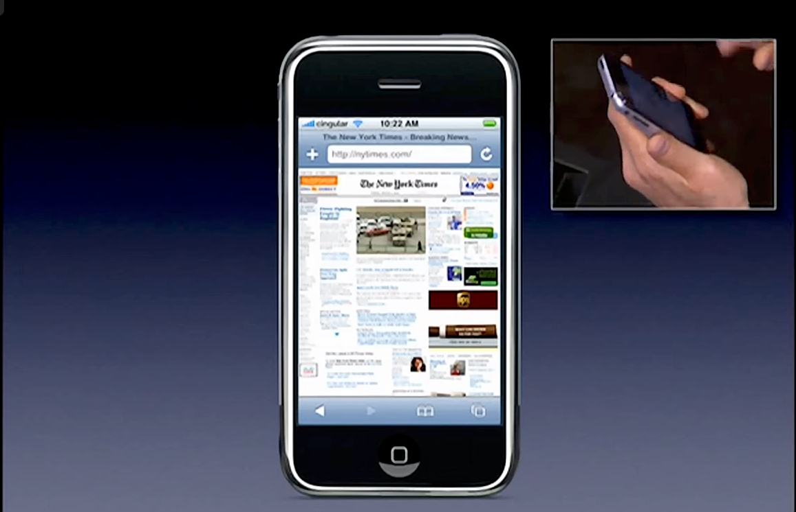
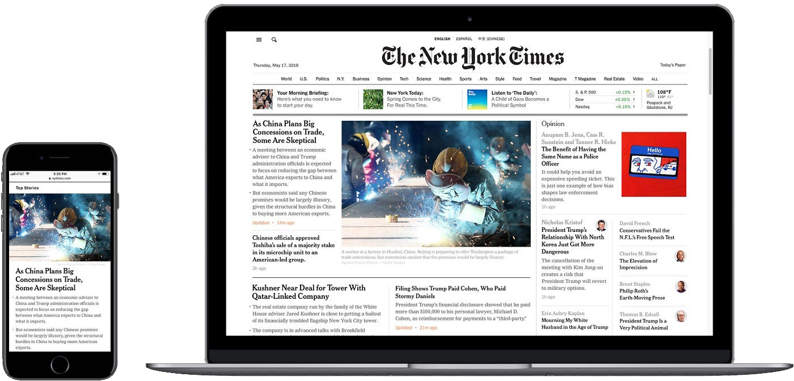
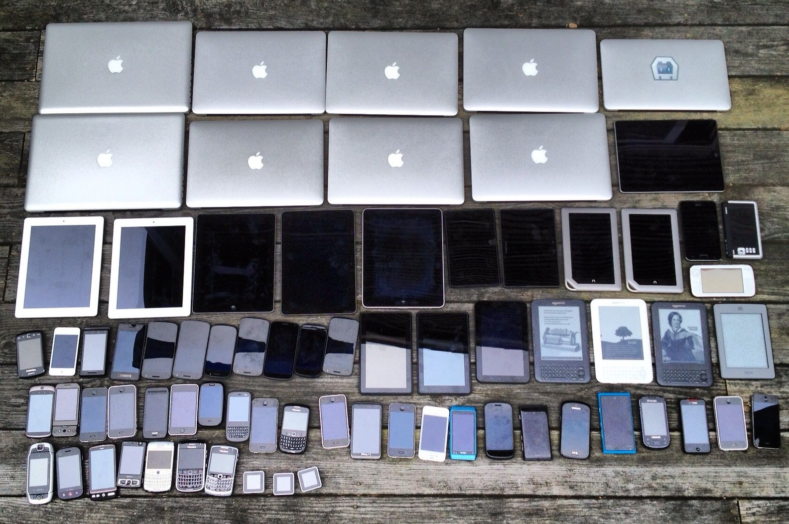
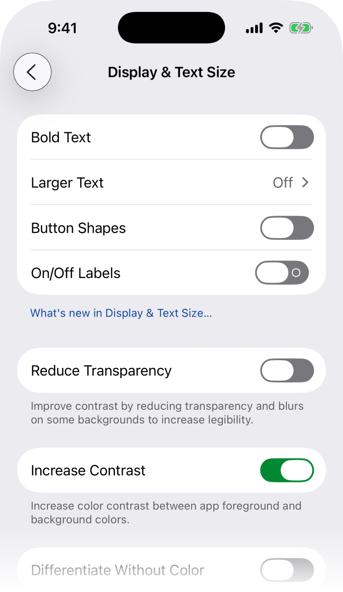
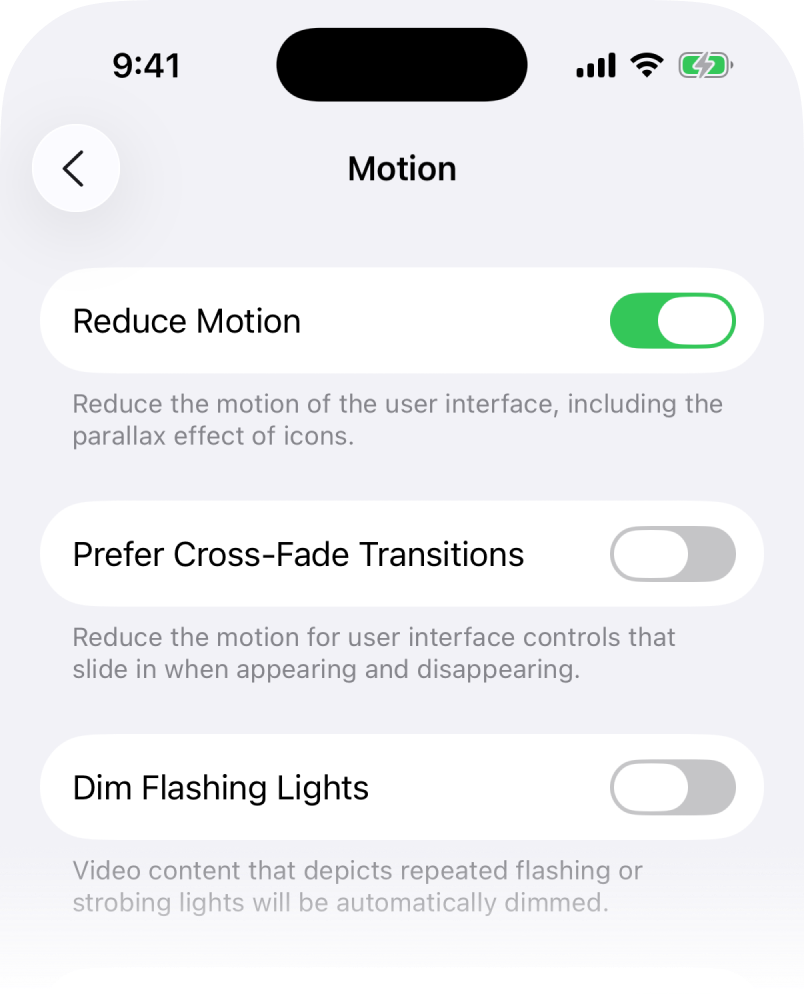

```javascript
const week = 7
const order = 1
const draft = true
```

# Responsive Design

## What’s all this about *Responsive Design*?

**Instead of designing, implementing, and serving separate sites for different devices and specific scenarios—we can adapt just one to work across them all. This is *responsive design*.**
<!-- .body data-description -->

- [<cite>Responsive Design – MDN</cite>](https://developer.mozilla.org/en-US/docs/Learn/CSS/CSS_layout/Responsive_Design) \
	A pretty nice overview.

- [<cite>Beginner's Guide to Media Queries – MDN</cite>](https://developer.mozilla.org/en-US/docs/Learn/CSS/CSS_layout/Media_queries) \
	Slightly overlapping, but also good.

- [<cite>Using Media Queries – MDN</cite>](https://developer.mozilla.org/en-US/docs/Web/CSS/Media_Queries/Using_media_queries#media_features) \
	Okay, that’s probably enough MDN.
<!-- .right .rows--3 -->

This term was coined in 2010 or so [by Ethan Marcotte](https://alistapart.com/article/responsive-web-design/)—wrapping a name around a [*progressive enhancement*](https://alistapart.com/article/understandingprogressiveenhancement/) and [*mobile-first*](https://www.lukew.com/ff/entry.asp?933) web design approach/philosophy that had been growing in the mid-2000s (sometimes called *liquid, flexible, fluid,* or *elastic* design).
<!-- .before -->

There was a confluence of events that allowed this: modern, <nobr>self-updating</nobr> browsers, and then the explosion of *the mobile web*—precipitated, in no small part, by the *iPhone* in 2007.

The iPhone was the first mobile device that ran a desktop-class browser (in terms of functionality), which hadn’t been available in a small screen before. And with its [crazy success](https://asymco.com/2026/09/28/the-best-selling-product-of-all-time/)—and the subsequent proliferation of its paradigm in *Android*—the web, and then world, scrambled to *respond*.

You’ve probably noticed this kind of pattern:
<!-- .before -->

<figure class="borderless shadow verso" style="--max: initial">

<figcaption>

A typical/example *responsive* layout, adjusting the content to reflow based on the device width.

</figcaption>
</figure>

<figure class="borderless recto shadow start">

</figure>

> Empty your mind. Be formless, shapeless, like water.
>
> You put water into a cup, it becomes the cup. You put water into a bottle, it becomes the bottle. You put it into a teapot, it becomes the teapot.
>
> Now water can flow or it can crash. Be water, my friend.
>
> [<cite>Bruce Lee, 1971</cite>](https://www.youtube.com/watch?v=UE8QBufrxCA)

>	Content is like water.
>
>	Content’s going to take many forms, flow into many different containers, many of which we haven’t even imagined yet. Build from content out, not container in.
>
> [<cite>Josh Clark, 2012</cite>](https://bigmedium.com/jhc/prez/mobile-myths.pdf)

## The Viewport

There wasn’t much of a *mobile web*, prior to the iPhone. *Some* sites had barebones [WAP](https://en.wikipedia.org/wiki/Wireless_Application_Protocol) mobile versions, designed for the tiny screens and limited hardware of the era.
<!-- .before .center -->

<figure class="right" style="margin-block-start: initial">
<figcaption>

This is how the *Times* looked on your [Razr](https://en.wikipedia.org/wiki/Motorola_Razr). [<cite>↗</cite>](https://wapreview.com/164/)

</figcaption>

</figure>

<figure class="left" style="margin-block-start: initial">
<figcaption>

The iPhone’s introduction is worth a watch. Safari! [<cite>↗</cite>](https://youtube.com/watch?v=VQKMoT-6XSg&t=2474)

</figcaption>

</figure>

When the iPhone came on the scene, most desktop websites still didn’t have narrow/smaller (let alone flexible) layouts—so the phone would instead [*scale* or *zoom out*](https://developer.apple.com/library/archive/documentation/AppleApplications/Reference/SafariWebContent/UsingtheViewport/UsingtheViewport.html) a desktop site design down to fit.
<!-- .antibody .balance .center style="margin-block-start: initial" -->

Websites at the time were often designed to a [standard width](https://960.gs) (usually `960px`), which the phone shrank down to its `320px` screen—and then the user could zoom in or out, scrolling around to view the whole page. It somewhat worked—and all the content was there, unlike most mobile sites—but it was obviously less than ideal!
<!-- .center style="margin-block-start: initial" -->

<figure class="right" style="margin-block-start: initial">

<figcaption>

Their full desktop site back then, scaled down, on an iPhone. [<cite>↗</cite>](https://web.archive.org/web/20070111094339/http://www.apple.com/iphone/internet/)

</figcaption>
</figure>

### Viewport `<meta>` Tag

<div class="balance body">

So the web had to evolve for this new class of devices.

You’ll see [this `<meta>` element](https://developer.mozilla.org/en-US/docs/Web/HTML/Viewport_meta_tag) in the `<head>` of pretty much every website, nowadays—which tells the browser *not* to do this scaling down:

</div>

- [<cite>Viewport concepts – MDN</cite>](https://developer.mozilla.org/en-US/docs/Web/CSS/Viewport_concepts)
*Usually* “the browser window.”

- [<cite>`viewport` value – MDN</cite>](https://developer.mozilla.org/en-US/docs/Web/HTML/Viewport_meta_tag) \
	How the page should be sized!
<!-- .right -->

```html <!-- .all .before .large -->
<meta name="viewport" content="width=device-width, initial-scale=1">
```

**You’re saying “this page has a *responsive* design! Render it at its actual size. The content can reflow.”**

The `width=device-width` tells the browser to use whatever the screen’s *actual* pixel dimension is, and the `initial-scale=1` sets the starting zoom for the page to 100%. This is how the browser knows how to make the page respond, and how our CSS rules know what `width` to use.
<!-- .center .verso style="margin-inline-end: 1rlh" -->

<figure class="borderless recto">
<figcaption>

The *Times* wasn’t fully responsive until *2018*! They still maintained a separate mobile site and apps. [<cite>↗</cite>](https://open.nytimes.com/a-faster-and-more-flexible-home-page-that-delivers-the-news-readers-want-1522ff64aa86)

</figcaption>

</figure>

**We call the portion of the page visible at one time [*the viewport*](https://developer.mozilla.org/en-US/docs/Web/CSS/Viewport_concepts).**

## Media Queries

Responsive design could really only flourish when CSS (and browsers) added the `@media` [<nobr>*at-rule*</nobr>](https://developer.mozilla.org/en-US/docs/Web/CSS/Media_Queries) to work with this new device information.

- [<cite>CSS media queries – MDN</cite>](https://developer.mozilla.org/en-US/docs/Web/CSS/Media_Queries) \
	Checking for viewport values.
<!-- .right -->

<div class="balance before verso">

These are colloquially called *media queries*, and they allow us to check if our reader’s screen is a certain width or resolution (or other features, which we’ll [get to](#other-media-features))—and then apply selective CSS only in that scenario/situation. These let site layouts *respond* intentionally to different devices.

Practically, these are blocks of CSS—a little bit like [*selectors*](../css/index.md#basic-selectors) that contain other selectors—but which only apply *conditionally* when the test/criteria is met.
<!-- .before -->

Like any other CSS—if there are multiple conditions that are met, or there is a tie between properties—the rules [*cascade*](../css/index.md#oh-right-the-cascade) down and the lowest/last one takes precedent.

</div>

<div class="before recto">

```css <!-- .sticky style="inset-block-start: 33vh" -->
/* Our CSS has all been out here! */

@media (feature = value) {
	/* CSS that only applies when true. */
}
```

</div>

**In a broader code and programming context, it can be helpful to think of media queries as [conditional *if* statements](https://en.wikipedia.org/wiki/Conditional_(computer_programming)).**

<sub>We’ll talk about this in detail later [with JavaScript](https://developer.mozilla.org/en-US/docs/Web/JavaScript/Reference/Statements/if...else), where conditionals are ubiquitous and powerful! You may have also heard of [*If This Then That*](https://ifttt.com), which takes its name from this kind of logic.</sub>

### Width-Based *Breakpoints*

There are many media queries we can use, but we’ll start with `width`—which is by far the most commonly-adjusted and really the core of *responsive design*. Usually when folks are talking about a page or site being *responsive*, they primarily mean with regards to its  `width`.

[<cite>`width` media feature – MDN</cite>](https://developer.mozilla.org/en-US/docs/Web/CSS/Reference/At-rules/@media/width) \
The most common, by far.
<!-- .right -->

**Our design responds in steps, at different `width`, that we call *breakpoints*—the window/device/viewport sizes where the content *starts to break,* if it is not adjusted.**
<!-- .before -->

> [!NOTE]
>
> Note that we still use `width` here—not the [logical property](../box-model/index.md#and-logical-properties) `inline-size`—because we are actually referencing the *physical* device characteristics, agnostic of the language being displayed.
>
> <sub>We’ll also continue to use `px` with these, for ease of understanding: while `em`/`rem` are [technically *correct*](https://keithjgrant.com/posts/2023/05/px-vs-em-in-media-queries/) for media queries, we’ve decided [the tooling](../dev-tools/index.md#device-mode) around this is still unclear!</sub>

#### There Is No Perfect Layout

<div class="before center verso">

The horizontal axis tends to vary the most across devices—from the ~`375px`–`428px` of your phones, through to the ~`1440px`–`1680px` of your laptops, and then on up to the ~`2560px`–`3440px` you might see with large, desktop displays.

Since this `width` is usually our primary design constraint (`height` being handled through scrolling), we need *width-based* media queries to adjust our layouts across this wide range, lest our designs fall.

You might add a *breakpoint* because lines of text get too short or too long, becoming [hard to read](../typography/index.md#ragging). It might be to prevent a grid of images from becoming too small on a phone—while you can have many columns on desktop, often you can only have one (or two) on mobile.
<!-- .before -->

You can add as many *breakpoints* as you need to make your page/design work across devices. Don’t think of these as written for specific *devices*; write for your *design* and for your *content*!

</div>

<div class="before recto">

<figure class="sticky" style="margin-block-end: 1rlh">

<figcaption>

This is from more than a dozen years ago, now. It’s really only gotten worse! [<cite>↗</cite>](https://www.flickr.com/photos/brad_frost/7387824246)

<figcaption>
</figure>

</div>

**There are very, *very* few layouts that won’t need some amount of horizontal responsiveness/breakpoints!**

> If you think responsive's simple, I feel bad for you son. We got 99 viewports, but the iPhone’s just one.
>
> [<cite>Josh Brewer, 2012</cite>](https://web.archive.org/web/20120925123125/https://twitter.com/jbrewer/status/178528003402379265)

---

#### Let’s Try It Out <!-- style="margin-block-start: initial" -->

In their simplest form, we just change whatever properties/values when they need adjustment! In this example, we would refer to the viewport `(width > 500px)` as our *breakpoint*:
<!-- .balance -->

<figure style="--lines: 9">

***[Width Example](media-width/style.css)***

<figcaption>

Drag the code/example divider to the left to see it *respond* to the `@media` query! You can <nobr>double-click</nobr> to reset it.

</figcaption>
</figure>

#### Adjusting *Variables*

Thinking more systematically, we can instead adjust the [`--variables`](../box-model/index.md#defined-as---variable) from our design system—making our intent more clear—“this *will* change”:
<!-- .balance -->

<figure style="--lines: 8">

***[Width Variable Example](media-width-variable/style.css)***

<figcaption>

Again, drag the divider to see rules apply. Same result as before! Try removing the first `--background` declaration.

</figcaption>
</figure>

#### Using *Comparisons*

Our queries can also use other simple math [comparison operators](https://css-tricks.com/the-new-css-media-query-range-syntax/#aa-new-comparison-operators), `<` `>` `=` `<=` `>=`:
<!-- .balance -->

[<cite>Query Range Syntax - CSS Tricks</cite>](https://css-tricks.com/the-new-css-media-query-range-syntax/#aa-new-comparison-operators) \
More modern, more intuitive.
<!-- .right -->

<figure style="--lines: 15">

***[Width Min/Max Example](media-width-min-max/style.css)***

<figcaption>

Exact matches (like the  `width = 500px` here) are rarely useful, though!

</figcaption>
</figure>

#### And Width *Ranges*

This [new comparison syntax](https://web.dev/articles/media-query-range-syntax) also allows simple, intuitive *ranges* to be specified—to see if the viewport is *between* two lengths:
<!-- .balance -->

[<cite>New syntax for range media queries - web.dev</cite>](https://web.dev/articles/media-query-range-syntax) \
Another comparison of old-and-new syntax.
<!-- .right -->

<figure style="--lines: 7">

***[Width Range Example](media-width-range/style.css)***

<figcaption>

Be mindful about “painting yourself into corners” with these! They make it easier to have unconsidered (or worse, overlapping) scenarios.

</figcaption>
</figure>

> [!WARNING]
>
> We’ll only be using the modern (and more intuitive) [range operator syntax](https://css-tricks.com/the-new-css-media-query-range-syntax/#aa-new-comparison-operators) shown here!
>
> <sub>You’ll see lots of material out there referencing `min-width` or `max-width` media queries—but we should *not* see these in [*your*](../../syllabus.md#attribution) code!</sub>

### Height-Based, Too

<div class="rows--2 verso">

<div class="balance sticky">

You can also use the viewport’s other axis `height` in the same way—though again, with the usual vertical scrolling paradigm, <nobr>*height-based*</nobr> adjustments aren’t often as necessary or anywhere nearly as common as `width`.

This example has the same *breakpoint* of `500px` as before, but now using `height`:

</div>

</div>

[<cite>`height` media feature – MDN</cite>](https://developer.mozilla.org/en-US/docs/Web/CSS/Reference/At-rules/@media/height) \
Less common, but still useful.
<!-- .before .right -->

<figure class="recto" style="--lines: 22; --max: round(calc(0.9 * var(--svh)), 1rlh); margin-block-start: 1rlh">

***[Height Example](media-height-min-max/style.css)***

<figcaption>

These code examples are responsive, themselves—stacking like this when they are narrow.

</figcaption>
</figure>

### Orientation

You can also be less specific about your `width`/`height` and instead use `orientation`—like when you rotate your phone. The queries use the wonderfully tenacious names/values of `portrait` or `landscape`:

[<cite>`orientation` media feature – MDN</cite>](https://developer.mozilla.org/en-US/docs/Web/CSS/Reference/At-rules/@media/orientation) \
Often more useful than `width` alone!
<!-- .right -->

<figure style="--lines: 11">

***[Orientation Example](media-orientation/style.css)***

<figcaption>

Note the `:`, instead of `=`. Everything was a painting before it was a photograph or a [web page](../everything/index.md)!

</figcaption>
</figure>

### And/Or Combinations

And speaking of *conditional statements*—you can also merge multiple media queries into one test/check, using `and`. This is often used for a range (to apply something *between* two breakpoints) or to combine `width` and `height` checks, together:
<!-- .balance -->

<figure style="--lines: 11">

***[“And” Example](media-and/style.css)***

<figcaption>

The demo here is taller than `300px`, for the second one.

</figcaption>
</figure>

You can also use comma-separated queries (similar to [*selector lists*](../css/index.md#compound-and-lists-selectorselector-selector-selector)) to apply *or* logic—setting the same styles for different scenarios:

<figure style="--lines: 7">

***[“Or” Example](media-or/style.css)***

<figcaption>

Note that you could do this with `and`, as in the example above, by just swapping the colors. Code logic!

</figcaption>
</figure>

There is also a `not` [logic operator](https://developer.mozilla.org/en-US/docs/Learn/CSS/CSS_layout/Media_queries#not_logic_in_media_queries)—which will reverse the meaning of the media query. But this syntax gets confusing fast—especially with things like `>`/`<` rules making for double-negatives. So it is easier to avoid!
<!-- .balance -->

<sub>Why say `not` `portrait` when you can just say `landscape`?</sub>

## *Mobile-First* Design

So this can all get very complicated, very quickly—especially with complex designs, overlapping rules, and the wide ranges of devices to consider.

- [<cite>Mobile First – A Book Apart</cite>](http://www.ferrispark.com/audio/DOCUMENTS/mobile-first.pdf) \
	[Luke Wroblewski](https://lukew.com/) wrote the book (and [the deck](https://static.lukew.com/MobileFirst_LukeW.pdf)).

- [<cite>Progressive Enhancement – Wikipedia</cite>](https://en.wikipedia.org/wiki/Progressive_enhancement) \
	The term coined by [Steve Champeon](https://www.webstandards.org/about/members/schampeo/index.html) and [Nick Finck](https://nickfinck.com/) in [2003](https://hesketh.com/publications/inclusive_web_design_for_the_future/).
<!-- .right .rows--3 -->

One of the easiest methodologies to keep things understandable is practicing [*mobile-first*](https://www.lukew.com/ff/entry.asp?933) design (and development). This has become kind of *buzzwordy* in the past decade or so, but it is a good philosophy to adhere to, nonetheless. It jives with the concept of [progressive enhancement](https://en.wikipedia.org/wiki/Progressive_enhancement).

Your design constraints will be tighter and more challenging, by tackling your smallest layout first—but it is almost always easier to scale things *up* than scale them *down*. A mobile design can always work as a passable desktop one; the reverse is rarely true. Another way to think of it:

**If it doesn’t work on mobile, it doesn’t work.**
<!-- .after -->

- **In Design:**

	*Mobile-first* means considering small screens and *then* adding complexity, limits, or considerations for larger screens. Start from your “worst-case scenario.”

- **In Code:**

	Similarly, this means writing your styles for mobile… first, *then* adding `width > #` breakpoints (cascading below them) to *progressively enhance* your design as it scales up.
	<!-- .balance -->

<figure style="--lines: 23">

***[Mobile-First Example](media-mobile-first/style.css)***

<figcaption>

Note we added a `main` container. The `inline-size` here are kind of tricky—but this will be much easier with `grid`, we promise!

</figcaption>
</figure>

This goes “[with the grain](../../week/7.md#reading-discussion),” following the general CSS pattern/paradigm of the cascade—and is much, much, *much* easier than adjusting desktop front-end after the fact. (Trust us.) Always think *mobile-first*&#x202F;!

**Mobile can be the majority of your traffic—[especially internationally](https://gs.statcounter.com/platform-market-share/desktop-mobile/worldwide)! We’d like you to think of *mobile-first* design as a form of accessibility, in this light. Not everyone has your MacBook Pro.**

### Using CSS Variables

[Custom properties](https://developer.mozilla.org/en-US/docs/Web/CSS/Using_CSS_custom_properties) (folks almost always say *CSS variables*) aren’t strictly a part of *responsive design* or *media queries*, per se—but they come up very often in modern, mobile-first practice and we’ll introduce them briefly, here. They allow you codify the relationships in your design.

[<cite>CSS Custom Properties Guide – CSS Tricks</cite>](https://css-tricks.com/a-complete-guide-to-custom-properties/) \
	Web guru [Chris Coyier’s](https://chriscoyier.net/) robust overview.
<!-- .right -->

<div class="balance before verso">

These bring another programming concept of [*variables*](https://en.wikipedia.org/wiki/Variable_(computer_science)) into CSS. These are shorthand entities for values we want to reuse throughout a document—or, in a responsive context, want to modify at certain breakpoints.

Changing the value of a *variable* changes it everywhere it is referenced—no copy/pasting or find/replacing. You could think of a color *swatch*, if you are in an Adobe mindset; other tech folks call these *tokens*. Again, these are just for you—it is all the same to the computer. More ergonomics!

In your CSS, you *declare* (set) these with a `--` prefix in front of a subjective name you make up. And you *reference* (use) them by wrapping that variable name in `var()`.

</div>

<div class="before recto">

```css <!-- .sticky style="inset-block-start: 35vh;" -->
:root {
	--brand-color: #e42a1d; /* Declare it. */
}

.brand-color {
	color: var(--brand-color); /* Reference it. */
}
```

</div>

You can use these as values for *any* [CSS property](../css/index.md#css-rules)—colors, spacing, etc.—anything you use multiple times and want to be consistent, give a memorable name to, or easily change all together:
<!-- .before -->

<figure style="--lines: 27">

***[Variable Example](css-variable/style.css)***

<figcaption>

Changing the spacing here is *easy*, even though we use it a bunch.

</figcaption>
</figure>

You’ll often declare a set of variables for mobile—type sizes, spacing, and so on—and then adjust them, once, for desktop. No need to write all the properties out again, with all their own redundant media-queries! Variables are *great*. It used to be *so much harder*.

They’ll help you avoid unwanted cascade (applying the same property), especially across breakpoints. But they also help to facilitate *design system* thinking—focusing your design on the relative *relationships* of things.

**Variables are how you build *design systems.* Like relative type scaling, they help to identify, catalyze, and maintain relationships in your work.**

## Other Media Features

By far, the most common media queries will be *width*/*height*/*orientation*—for adjusting your layouts across devices. But `@media` has some more tricks up its sleeve in testing for other browser features. We’ll look at some of the handy/common ones.

[<cite>`@media` types/features - MDN</cite>](https://developer.mozilla.org/en-US/docs/Web/CSS/@media#media_features) \
	There are many of these! Meet your users where they are.
<!-- .right -->

### `screen` vs. `print`

In all of our above examples, there is an implied *[media type](https://developer.mozilla.org/en-US/docs/Web/CSS/@media#media_types)* of `screen`—since that is usually what we are concerned with, on the web. But there is also one for <nobr>`print`&#x202F;!</nobr> You can use these to segment styles to one medium or the other:

[<cite>CSS paged media - MDN</cite>](https://developer.mozilla.org/en-US/docs/Web/CSS/CSS_paged_media) \
	There are also some print-specific properties available.
<!-- .right -->

<figure style="--lines: 26">

***[Print Example](media-print/style.css)***

<figcaption>

You can see the `print` style in action by going [directly to the example](media-print/), then <nobr><kbd>⌘</kbd> <kbd>P</kbd></nobr> to print. It is still *A Thing*, though often forgotten about in modern web design/projects.

</figcaption>
</figure>

> [!TIP]
>
> Increasingly, this is how many “print” documents are created—starting as webpages with `print` styles!
>
> <sub>When you get [a PDF](https://pagedjs.org) [ticket](https://weasyprint.org)/[receipt](https://www.princexml.com) or [even read](https://www.w3.org/2012/12/global-publisher/slides/Day2/P1-w3c-paris-hachette.pdf) [a book](https://www.xml.com/articles/2017/02/20/beyond-xml-making-books-html/), it’s likely styled HTML! Your Kindle’s [`EPUB` files](https://en.wikipedia.org/wiki/EPUB) are just HTML/CSS, too!</sub>
>
> Remember: [*everything* is a webpage](../everything/index.md#an-ever-present-visual-medium)!</sub>

### `hover`

Another common feature is `hover`, used to detect whether a browser has an input device that supports *hovering*—which really just means a mouse, usually on laptop/desktop computers.

[<cite>`hover` - MDN</cite>](https://developer.mozilla.org/en-US/docs/Web/CSS/@media/hover) \
	Mobile devices don’t have this!
<!-- .right -->

Mobile *touch-based* systems don’t have this behavior (and often react oddly to `:hover` CSS, “eating taps”), so you should adjust your interfaces to work in the absence of this state:

<figure style="--lines: 12">

***[Hover Example](media-hover/style.css)***

<figcaption>

If you view this on your phone, the `aside` should be visible without interaction. On your computer, you’ll have to mouse over the `div`. Note how this is written with a [*mobile-first*](#mobile-first-design) style, only adding the hover state later/lower for folks who have it!

</figcaption>
</figure>

Hover states are a good feature for *progressive-enhancement*, as we did here—to add them in *after* you have a working mobile design. Maybe a third to a half of your audience (depending on your project) won’t see them—so don’t rely on them being seen!

### `prefers-color-scheme`

You see this one more and more these days—`prefers-color-scheme` for switching up a site’s styles based on whether the user is in *light* or *dark mode*, popularized by the ol’ iPhone again:

[<cite>`prefers-color-scheme` - MDN</cite>](https://developer.mozilla.org/en-US/docs/Web/CSS/@media/prefers-color-scheme) \
	Michael prefers `dark`; Rijk prefers `light`.
<!-- .right -->

<figure style="--lines: 22">

***[Color-Scheme Example](media-color-scheme/style.css)***

<figcaption>

You’ll see this differently depending on whether your system is in light or dark mode.

</figcaption>
</figure>

Sometimes this feels appropriate—especially in products/applications, like maybe a messaging service. But sometimes the color scheme of a site is its *brand* (like ours), and probably shouldn’t change based on this query. It’s up to you! Continuing our ongoing discussion of who has the control.

### `prefers-contrast` / `prefers-reduced-motion` <!-- .all -->

These last two are primarily concerned with [accessiblity](https://developer.mozilla.org/en-US/docs/Web/Accessibility)—`prefers-contrast` for folks who run their device/browser in a high-contrast mode to help with their vision, or `prefers-reduced-motion` for those who have animations turned off for vestibular reasons.
<!-- .body -->

- [<cite>`prefers-contrast` - MDN</cite>](https://developer.mozilla.org/en-US/docs/Web/CSS/@media/prefers-contrast)
- [<cite>`prefers-reduced-motion` - MDN</cite>](https://developer.mozilla.org/en-US/docs/Web/CSS/@media/prefers-reduced-motion) \
	You can think of both subtlety and motion as progressive enhancements.
<!-- .right .rows--3 -->

<sub>Or these are just their preference! None of your business.</sub>

```css <!-- .center .verso -->
:root {
	/* Default to high contrast… */
	--background: white;
	--foreground: black;
}

p {
	background-color: var(--background);
	color: var(--foreground);
}

/* When “Increase Contrast” is *not* enabled. */
@media (prefers-contrast: no-preference) {
	:root {
		/* …use designer/subtle/nuanced colors. */
		--background: lightgray;
		--foreground: slategray;
	}
}
```

<figure class="recto" style="grid-column: four-start / five-end">

<figcaption>

The corresponding settings in i&NoBreak;OS.

</figcaption>
</figure>

```css <!-- .center .verso -->
/* When “Reduce Motion” is *not* enabled. */
@media (prefers-reduced-motion: no-preference) {
	button {
		animation: some-slick-animation;
	}
}
```

<figure class="recto" style="grid-column: four-start / five-end">

</figure>

> The power of the Web is in its universality.
>
> Access by everyone regardless of disability is an essential aspect.
>
> [<cite>Tim Berners-Lee, 1997</cite>](https://www.w3.org/Press/IPO-announce)
