```javascript
const week = 2
const draft = true
```

# It’s All About Type

## A Brief History of Typography

> Writing gives the impression of things. Conversely, things can give the impression of writing.
>
>	[<cite>Paul Elliman, 1998</cite>](https://readings.design/PDF/MyTypographies.pdf)

**Typography is the form and structure into which words are manifested into our world. It has a long and storied history, and it’s our job to both understand this history and, from it, how to apply type effectively.**
<!-- data-description -->

<figure class="aside">
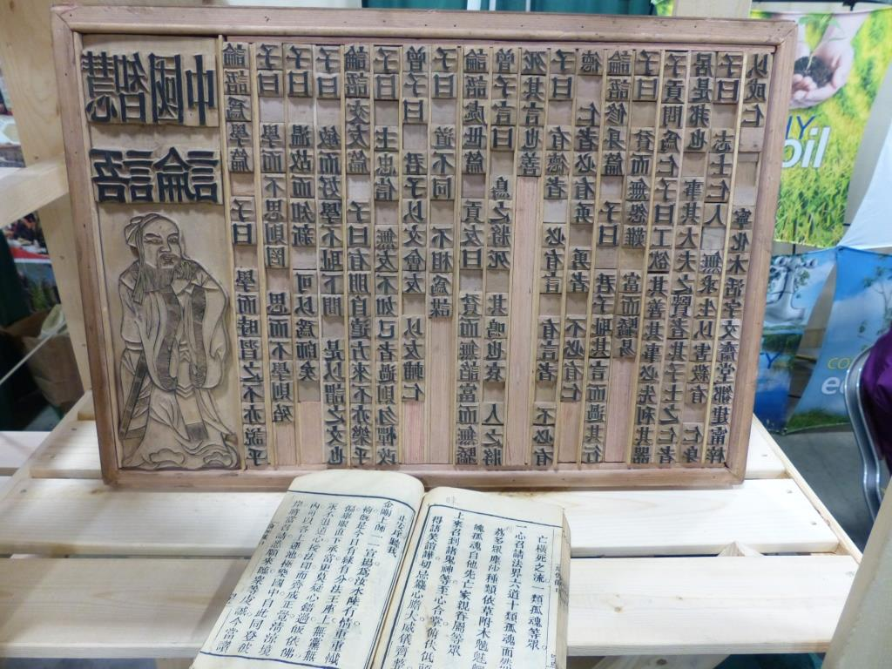
<figcaption>

Early example of Chinese movable type.

[<cite>↗</cite>](https://dghaskell.com/2014/10/13/move-over-gutenberg-carved-movable-type-from-china/)

</figcaption>
</figure>

<div class="body center">

While [Johannes Gutenberg](https://en.wikipedia.org/wiki/Johannes_Gutenberg) is widely associated with inventing the printing press and movable typography in 1450, earlier forms had been invented [around 1040](https://en.wikipedia.org/wiki/Movable_type#Ceramic_movable_type) in Asia, by Chinese polymath [Bi Sheng](https://en.wikipedia.org/wiki/Bi_Sheng).

We’ll begin in the early 1500s with [Albrecht Dürer](https://en.wikipedia.org/wiki/Albrecht_Dürer), a seminal figure of the German Renaissance. Dürer made the first inroads towards a *methodology* of type design, the beginnings of formal typography.

Dürer examined Roman letterforms and attempted to create a rational *system* for recreating glyphs, specifically drawing attention to the form in which words appear. The way words appeared then, as now, was a byproduct of the medium in which they were written.

</div>

<figure class="right borderless" style="--lines: 12" >
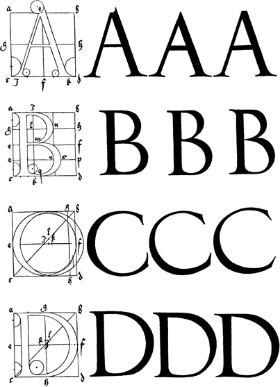
<figcaption>

Image from Dürer’s *Directions for the Construction of the Text.*

[<cite>↗</cite>](https://biblioklept.org/2013/11/12/directions-for-the-construction-of-the-text-albrecht-durer/)

</figcaption>
</figure>


<figure style="--lines: 15">
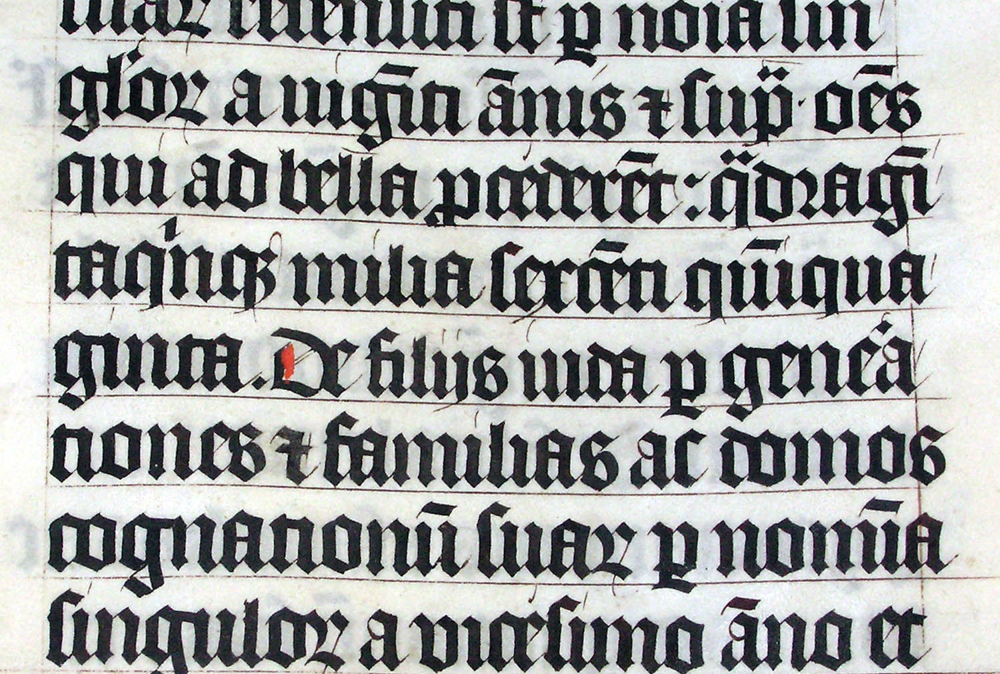
<figcaption>

An early example of blackletter script—a style that reflected the thick nibbed pens that were in use at the time.

[<cite>↗</cite>](https://en.wikipedia.org/wiki/Blackletter)

</figcaption>
</figure>

> [!NOTE]
>
> Our discussion of typesetting here is within a narrow Western (and subsequently American) tradition.
>
> The norms, conventions, and rules will be different, [outside of that lens](https://en.wikipedia.org/wiki/History_of_printing_in_East_Asia)—and we recognize we have a limited ability to speak to other paradigms.
>
> <sub>We encourage students to bring their own experience in this area—introducing us all to other typographic forms, customs, and traditions.</sub>

## The First “Typefaces”

<figure class="aside">
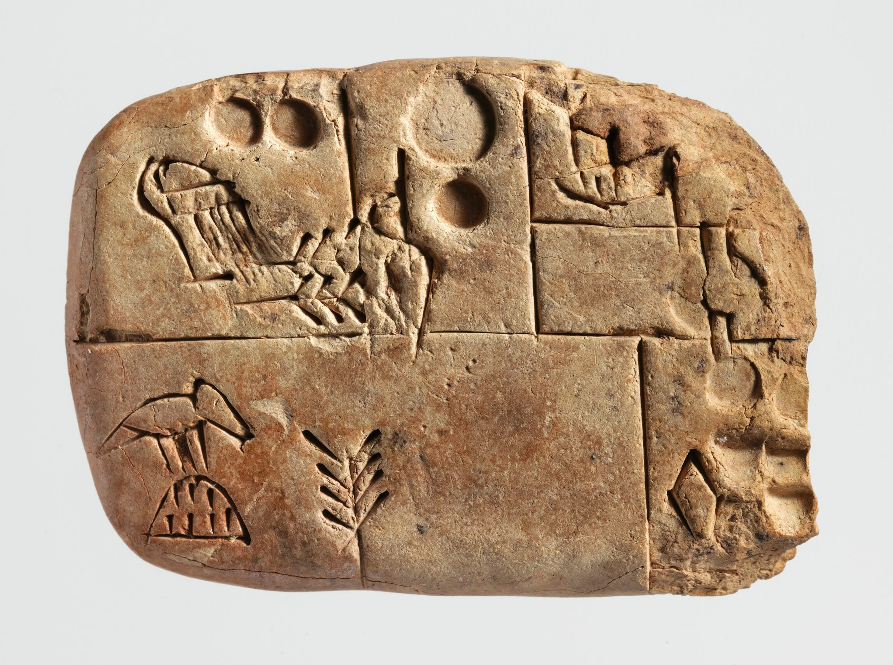
<figcaption>

Cuneiform tablet: administrative account concerning the distribution of barley and emmer.

[<cite>↗</cite>](https://www.metmuseum.org/art/collection/search/327384)

</figcaption>
</figure>

<section>

<div class="verso">

<div class="sticky">

The first “typefaces” weren’t typefaces at all. Early writing was used primarily as a means for recording and storing information. Care was generally not given to the presentation of forms on physical medium, but to the information as such.

Often, words and forms were expressed into a particular physical medium with whatever tools were available. These tools shaped the ways words were shown and presented
</div>

</div>

<div class="recto">

<figure class="recto start borderless" style="--lines: 7">
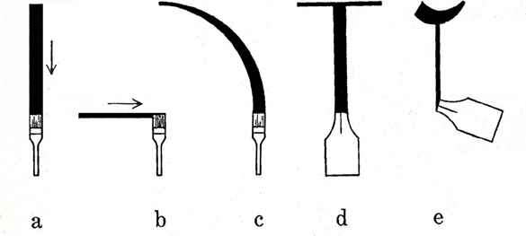
<figcaption>

Brush and pen strokes defining typeforms.

[<cite>↗</cite>](https://www.thing.net/~grist/ld/TextBackHome/Roman.htm)

</figcaption>
</figure>

<figure class="recto start borderless" style="--lines: 15" >
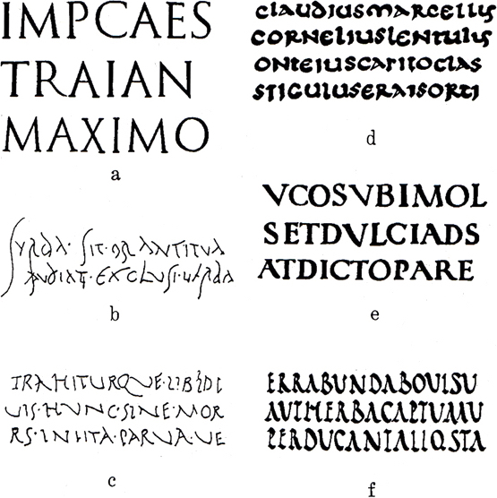
<figcaption>

Type forms which came from chisel on marble *(a)*, stubby pen or metal stylus *(b, c)*, reed pen *(d)*, reed pen inspired by stone *(e)*, and pen or brush on parchment *(f)*.

[<cite>↗</cite>](https://www.thing.net/~grist/ld/TextBackHome/Roman.htm)

</figcaption>
</figure>

</div>

</section>

## Metal Type

The first typefaces created with movable type attempted to emulate handwritten scripts. A typeface designer would create a *punch* which would function as the source from which a metal form would be created.
<!-- .center .verso -->

<figure class="recto borderless" style="--lines: 15">
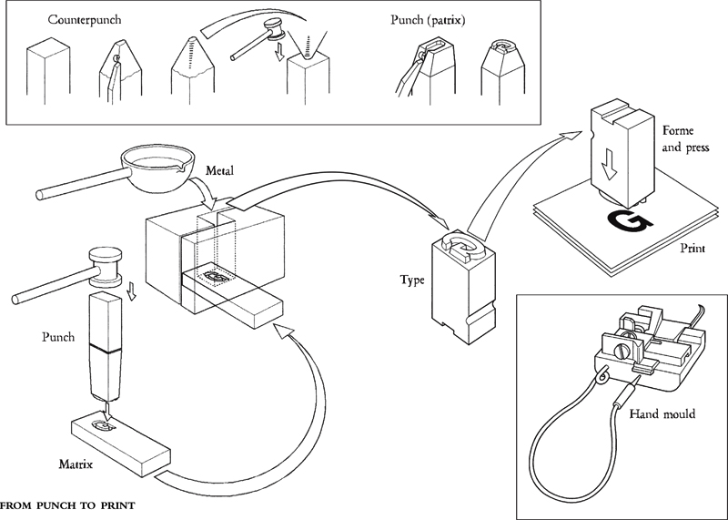
<figcaption>

Creating movable type from punch cut forms.

[<cite>↗</cite>](https://web.archive.org/web/20230924025255/https://erenow.org/biographies/gutenberg-how-one-man-remade-the-world-with-words/6.php)

</figcaption>
</figure>

**Many of the terms that were created to describe physical attributes of metal type (*leading*, *point size*, *shoulder*) continue through to our digital world:**

<figure class="verso">
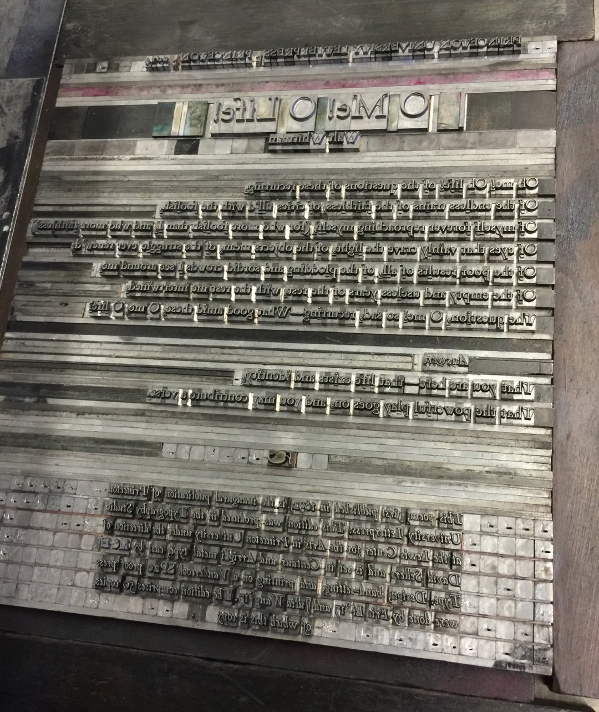
<figcaption>

A “lockup” of metal type, describing the frame holding forms together. We still use this phrase to refer to design layouts!

</figcaption>
</figure>


<figure class="recto">
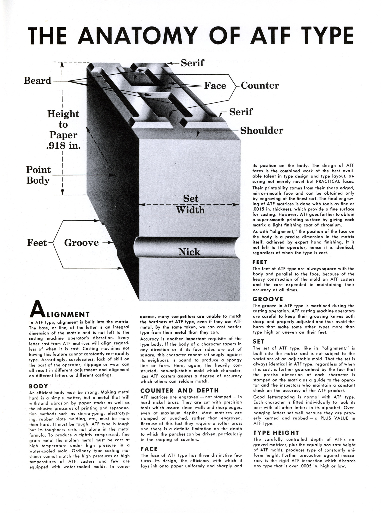
<figcaption>

Anatomy of metal type.

[<cite>↗</cite>](https://www.flickr.com/photos/depressionpress/2009461000)

</figcaption>
</figure>

Type was stored in drawers where the *lower* case held the uncapitalized forms, and the *upper* case held the capital forms. Sound familiar?
<!-- .center .verso -->

<figure class="recto">
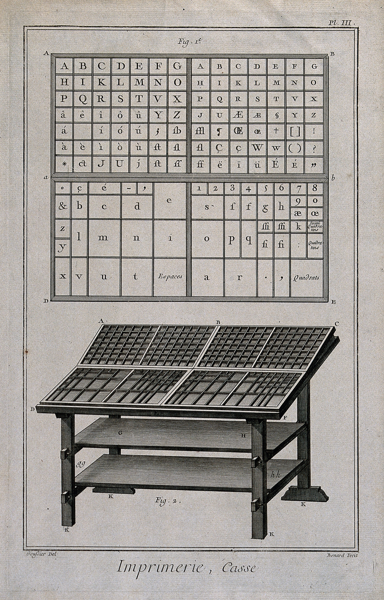
<figcaption>

Conventions and standards carry on through history!

[<cite>↗</cite>](https://commons.wikimedia.org/wiki/File:Plan_%28top%29,_and_three-quarter_view_%28below%29,_of_a_type_case,_Wellcome_V0023764.jpg)

</figcaption>
</figure>

## Technological Evolution

<figure class="aside" style="--aspect-ratio: 4 / 3">
<iframe src="https://player.vimeo.com/video/127605643?h=3281eeb33f&color=99CC99&title=0&byline=0&portrait=0"></iframe>
<figcaption>

*Farewell Etaoin Shrdlu*, a documentary made at the end of the metal type era at *The New York Times*, in 1978.

[<cite>↗</cite>](https://archive.nytimes.com/www.nytimes.com/times-insider/2014/11/13/1978-farewell-etaoin-shrdlu/)

</figcaption>
</figure>

Over time, as technologies evolved, type and typesetting transitioned as well. We moved from hand-setting movable type in composing sticks to [*Linotype*](https://en.wikipedia.org/wiki/Linotype_machine) typesetting. This allowed for machines to create an entire <nobr>*line-of-type*</nobr> as a metal slug, which could then be put into layout.

<div class="body center">

With the advent of the photocopier, we quickly moved from metal type to phototypesetting—which worked by [projecting text silhouettes](https://www.digitalcheck.com/phototypesetters-printing/) onto a light-sensitive medium. This was significantly less constrained than metal type—allowing novel typographic compositions and dramatically increasing speed.

In fact, some of the first computer programs for digital typesetting, such as [`troff`](https://en.wikipedia.org/wiki/Troff), were created to support and drive phototypesetting processes.

</div>

<figure class="right start" style="--lines: 15" >
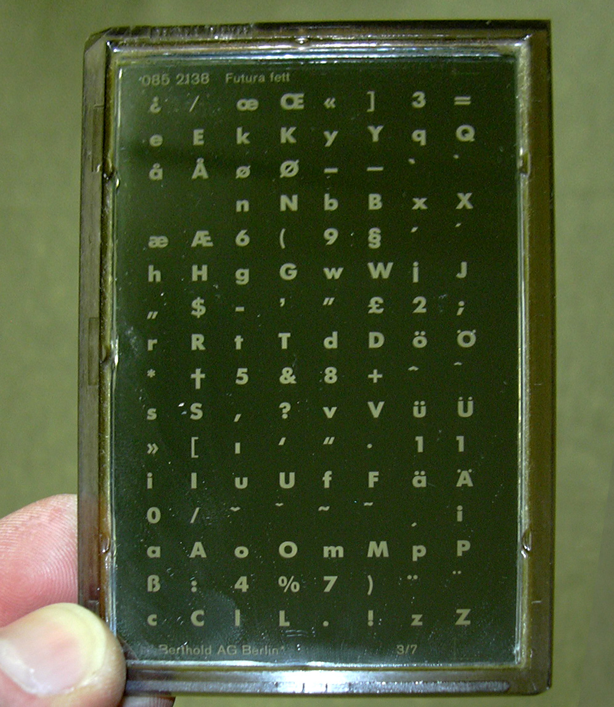
<figcaption>

A master plate for *Futura* phototypesetting.

[<cite>↗</cite>](https://en.wikipedia.org/wiki/Phototypesetting)

</figcaption>
</figure>

### A Transition to Digital

<div class="body center">

By the early 1980s, as the internet was being formed and the web had yet to exist, the advent of computers with screens and visual interfaces made the final typesetting transition: from physical to digital.

Most significantly, the [Apple Macintosh and Lisa](https://www.youtube.com/watch?v=2B-XwPjn9YY) were significant milestones in providing the first visual document editing experience on a computer. The term *What You See Is What You Get* (WYSIWYG) begins with this era of consumer computing.

</div>

<figure class="right">
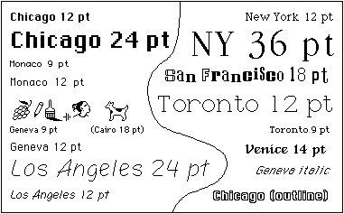
<figcaption>

Some typefaces that came with the original Macintosh. Look familiar?

[<cite>↗</cite>](https://en.wikipedia.org/wiki/Fonts_on_Macintosh#Fonts_of_the_original_Macintosh)

</figcaption>
</figure>

> [!TIP]
>
> Our course site this year is set in these early Mac fonts, designed by [Susan Kare](https://www.moma.org/artists/38483)—who created the suite of [digital-only typefaces](https://www.storiesofapple.net/the-first-fonts-of-the-macintosh.html) for the platform.
>
> <sub>Your medium, its limitations, and its typography are always intertwined! As with this site, they can both constrain and enrich your work.</sub>

<figure class="aside">
<iframe src="https://www.youtube.com/embed/ZmWOtf4Ziso"></iframe>
<figcaption>

Susan explains how to use the Macintosh interface, in 1984.

</figcaption>
</figure>

<figure class="borderless aside">
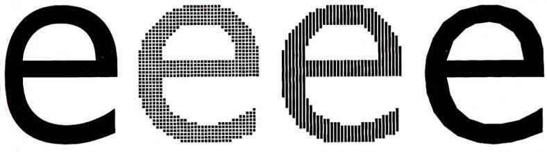
<figcaption>

Physical type had to be converted to digital formats in order to be presented on a screen. We started with pixel and bitmap encodings of typefaces, before switching to vector-based representations.

[<cite>↗</cite>](http://www.designhistory.org/Digital_Revolution_pages/EarlyDigType.html)

</figcaption>
</figure>

With the transition to digital screens, the representation of fonts also evolved over time. Today, almost all digital fonts are presented as vectors—the basic mathematical instructions for recreating the letterforms.

<figure style="--lines: 8" >
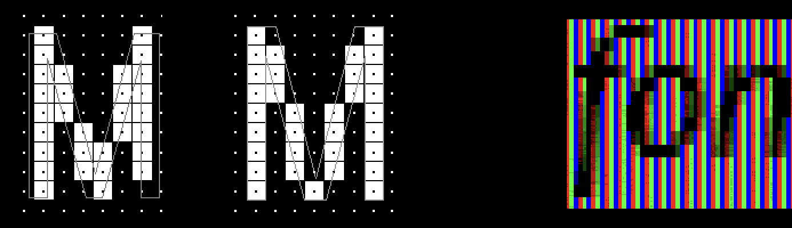
<figcaption>

Hinting typefaces to sit on a pixel grid.

[<cite>↗</cite>](http://www.designhistory.org/Digital_Revolution_pages/EarlyDigType.html)

</figcaption>
</figure>

However, while vector files are infinitely scalable, the medium on which they are shown (screens) are not. As with any analog to digital process, there is some loss of information as a computer samples the original shape of a glyph and then maps it to a pixel grid.

This is how we get artifacts such as [*aliasing*](https://en.wikipedia.org/wiki/Aliasing), which happens when a line or curve doesn’t land perfectly on the pixel grid. The operating system and display use shades of gray to trick our eyes into seeing a smooth curve.

## So What Is a Typeface?

<figure>
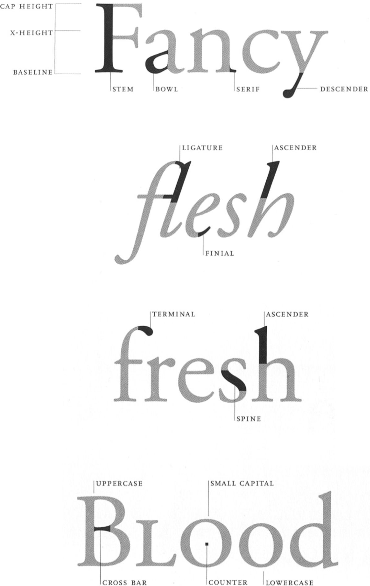
<figcaption>

Anatomy of a typeface, from Ellen Lupton’s *Thinking with Type*.

[<cite>↗</cite>](https://readings.design/PDF/thinkingwithtype_ellenlupton.pdf)

</figcaption>
</figure>

A typeface has distinct characteristics and properties that make it unique from other typefaces. Beyond the visual manifestation of each glyph, typefaces contain metrics that aren’t visible, such as *kerning*.

<details>
<summary>

What Is the Difference Between a Typeface and a Font?

</summary>

A *typeface* is a *font family*—a collection of fonts based on the same design.

The term *font* is mostly used for a single style such as *Geneva 12 Bold*.

</details>

<figure style="--lines: 13">
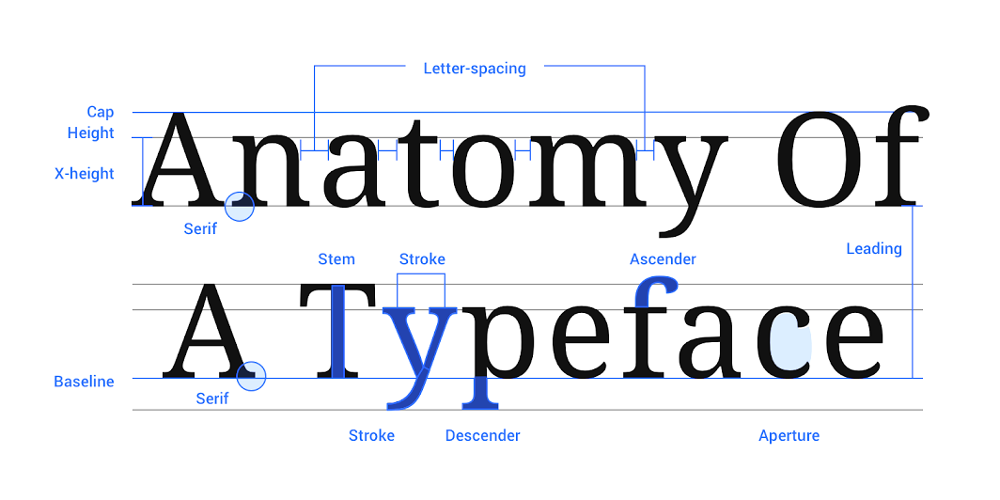
<figcaption>

More typeface anatomy!

[<cite>↗</cite>](https://material.io/design/typography/understanding-typography.html)

</figcaption>
</figure>

Broadly, we’ll refer to several main styles of typefaces:

<span style="--size: var(--size--h2); font-family: serif">Serifs</span>

: These have small lines (*serifs*) attached to the ends of letters

<span style="--size: var(--size--h2); font-family: sans-serif">Sans Serifs</span>

: Without these lines (like this site)

<span style="--size: var(--size--h2); font-family: monospace">Monospace</span>

: All characters the same width (as in `code`)

<span style="--size: var(--size--h2); font-family: fantasy">Decorative</span>

: …everything else (be careful)

While there are distinct [subfamilies within](https://www.fonts.com/content/learning/fontology/level-1/type-anatomy/type-classifications) each of these, our selection of a typeface from one of these particular styles already conveys significant meaning.

<details>
<summary>

What Are Things to Consider When Picking a Typeface?

</summary>

- Readability

- Legibility

- Meaning

- Historical context

- Past usage

- Visual appearance (“vibe”)

- Licensing/rights

</details>

> Because it works.
> Because you like its history.
> Because you like its name.
> Because of who designed it.
> Because it was there.
> Because they made you.
> Because it reminds you of something.
> Because it’s beautiful.
> Because it’s ugly.
> Because it’s boring.
> Because it’s special.
> Because you believe in it.
> Because you can’t not.
>
> [<cite>Michael Bierut, 2017</cite>](https://www.fastcompany.com/90148989/how-pentagrams-michael-bierut-picks-a-typeface)

## Typesetting and Layout

### Type Size, Weight, and Color

A heading (or *display text*) should appear differently than body text (also called *body copy*), which should appear differently than lists, which should appear differently than links, and so on. A well-typeset document considers all of these elements, working together, to create a clear, cohesive layout.

As you typeset it is also important to treat things consistently—headings should always look the same, so that a reader will understand what they are looking at visually.

<!-- TODO `object` instead of `img`? -->

<figure>
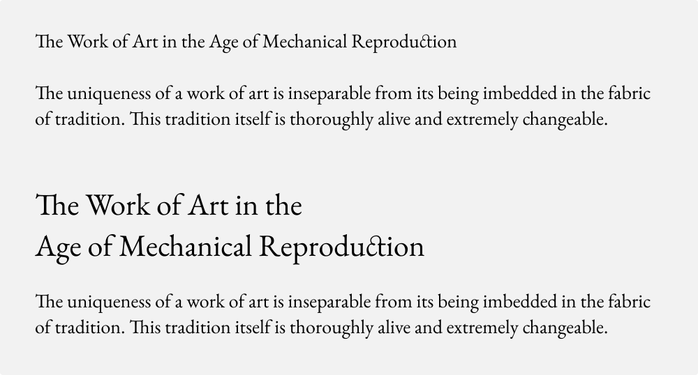
<figcaption>

An example of how type *size* informs hierarchy.

</figcaption>
</figure>

We can use differing *type sizes* to distinguish between headings and body text. Generally, we aim to create a visual type hierarchy where the most important parts of a document have the largest size (headings), scaling down through our main, body text to the least important (captions or footnotes) as the smallest.

<figure>
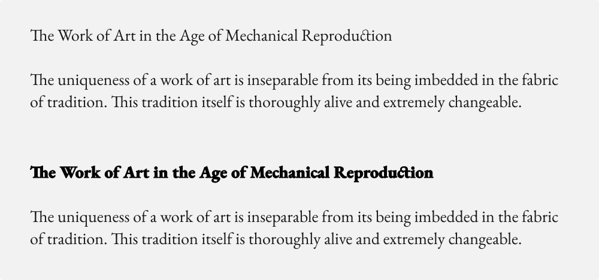
<figcaption>

An example of how type *weight* informs hierarchy. Did your eyes skip over the first block?

</figcaption>
</figure>

But the literal size is not our only tool. Another way we can distinguish copy within a document is by making use of *weights*—varying the thickness of the stroke. Good typefaces usually come in a range of weights to facilitate our designs—at the very least a *regular* (or *roman*), *bold*, and *italic* weight. Nowadays, [variable typefaces](https://v-fonts.com) allow us to pick and choose the exact weight combinations that we need.

<figure>
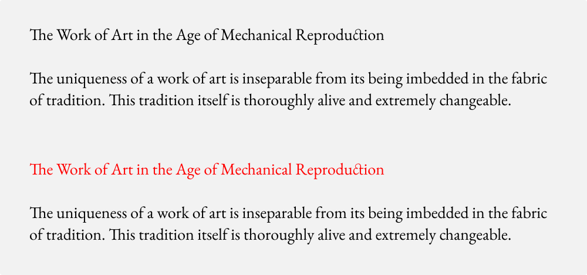
<figcaption>

An example of how type color informs hierarchy. We’re guessing you went to the red, first.

</figcaption>
</figure>

We can also use *color* as a visual element to distinguish our content. Above, we keep the type the same in both the heading and body text. But using only color, we are still able to set the heading apart.

Many of these principles of hierarchy are come from the [*Principles of Gestalt*](https://g-e-s-t-a-l-t.org/media/pdf/Investigations-on-Gestalt-Principles.pdf)—creating associations out of form. (These, in turn, are buried deep in our evolutionary history.) These principles [have become systematized](https://lawsofux.com/en/) in interactive work.

### Leading

<figure>
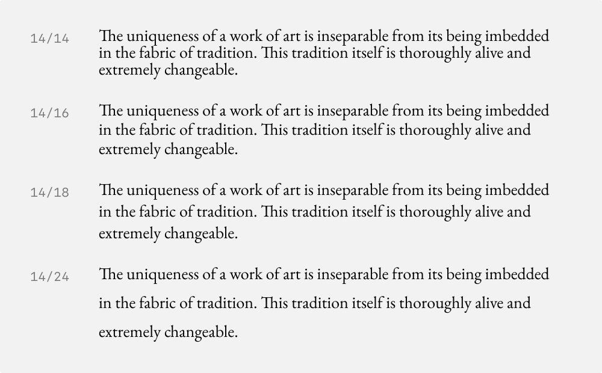
<figcaption>

An example of how leading can inform readability.

</figcaption>
</figure>

*Leading* refers to the the space between lines, harkening back to the days of moveable type when metal separated rows. Body text should have looser leading since it will be smaller; heading text can be tighter without losing legibility, since it will be set at a larger size.

We can tolerate close lines for short texts; we struggle with them over longer passages. The space between heading and body text should also be considered.

### Ragging

<figure>
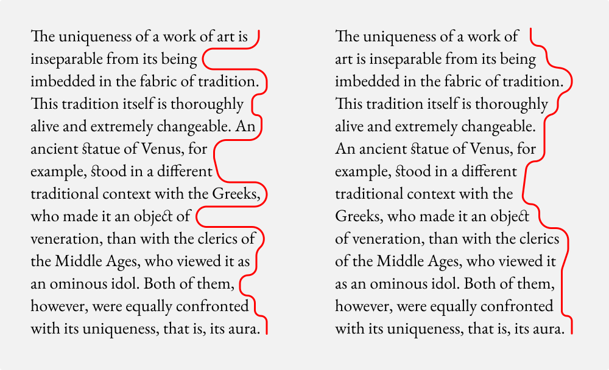
<figcaption>

An example of ragging text.

</figcaption>
</figure>

*Ragging* is the in-and-out flow of text on the right edge in a left-aligned block of text. (Or the left, in a [right-to-left](https://en.wikipedia.org/wiki/Right-to-left_script) script.) When setting type with a *ragged* edge (the norm in interactive, where [justification](https://practicaltypography.com/justified-text.html) is rare), pay attention to where each line ends.

A *good rag* is one where the lines move in and out in small increments. A not-so-good rag bounces the eye back and forth from line to line, creating distracting white spaces in the margin and hurting readability.

To avoid *bad rags*, we can make sure that the type size of a container is not too large and that the column is not too narrow. We want our text to land in nice rectangular and rounded, chunky blocks.

### Widows and Orphans

<figure>
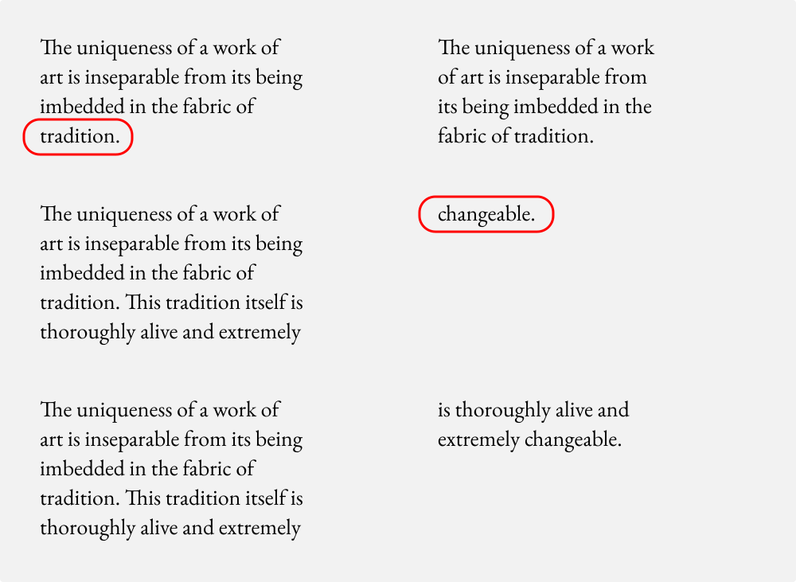
<figcaption>

An example of a widow *(left)* and orphan *(right)*.

</figcaption>
</figure>

*Widows* are short last lines of a paragraph, usually one word on its own or the end of a hyphenated word. Widows generally leave too much white space at the end of a line, making it look like an extra blank line—disrupting your typographic rhythm and spacing. The wider the line and the tighter the paragraph spacing, the more distracting the widow.

*Orphans* are short top lines of a page or column—abandoned on their own—that are also distracting. They create ambiguous design intention and hinder clear reading.

We should avoid orphans and widows through proper ragging, making sure that type sizes aren’t too large for a container, and making use of the [non-breaking space](https://en.wikipedia.org/wiki/Non-breaking_space) character, which makes sure there is not a line-break between two words.

We should also always *wrap* some words together (for example, *September 5*, or *van Zanten*), for ease of reading.

### Punctuation

It is also our job to make sure that we properly use punctuation—so it is in service of our content, not a distraction.

Various dashes are a [very common mistake](https://www.merriam-webster.com/words-at-play/em-dash-en-dash-how-to-use). *Hyphens* (-) are different than <nobr>*en-dashes* (–)</nobr> are different than <nobr>*em-dashes* (—).</nobr> We use hyphens to separate and break words, <nobr>en-dashes</nobr> to dictate a numerical range, and <nobr>em-dashes</nobr> to emphasize phrasing.

Another common mistake is misusing [apostrophes and quotations](https://cmosshoptalk.com/2019/03/19/smart-apostrophes-cmos-6-117/). By default, most computers will generate (&quot;) as a proper *curly* quote when you type it (the feature is usually called “smart quotes”). However, you should be prudent to use opening and closing quotes—note the difference between these two quotes:
<!-- style="margin-block-start: 2rlh" -->

&quot;These are sad, ambiguous, straight quotes.&quot;
<!-- style="--size: var(--size--h3)" -->

&ldquo;These are better, clearer, opening/closing quotes.&rdquo;
<!-- style="--size: var(--size--h3)" -->

A third mistake is to use characters rather than mathematical symbols. This common practice started when typewriters were the norm which only had a limited characters set. This excuse no longer applies! For example:
<!-- style="margin-block-start: 2rlh" -->

9 x 5&ensp;→&ensp;9 × 5<br>
9 / 5&ensp;→&ensp;9 ÷ 5<br>
<!-- style="--size: var(--size--h3)" -->

**When in doubt, [*The Elements of Typographic Style*](https://readings.design/PDF/the_elements_of_typographic_style.pdf) probably has the answers you need. It is among the best single references for typographic minutia.**

## Type Foundries

Where does one find typefaces? From *foundries*, again referencing the days when making type involved casting actual metal. While most computers now come with many good ones, there are many other places to get fonts. Here are some that we like:

- [<cite>Adobe Fonts</cite>](https://fonts.google.com/)
- [<cite>Comercial Type</cite>](https://commercialtype.com/)
- [<cite>Dinamo</cite>](https://abcdinamo.com/)
- [<cite>Forgotten Shapes</cite>](https://forgotten-shapes.com/)
- [<cite>Grilli Type</cite>](https://www.grillitype.com/)
- [<cite>Indian Type Foundry</cite>](https://www.indiantypefoundry.com/)
- [<cite>Klim</cite>](https://klim.co.nz/)
- [<cite>Lineto</cite>](https://lineto.com/)
- [<cite>MCKL</cite>](https://mckltype.com/)
- [<cite>Order</cite>](https://order.design/otf)
- [<cite>Typotheque</cite>](https://www.typotheque.com/)
<!-- .left .before--2 -->

<!-- BREAK -->

- [<cite>Google Fonts</cite>](https://fonts.google.com/)
	Free! And popular/huge.
- [<cite>Fontshare</cite>](https://www.fontshare.com/)
	Free! From *Indian Type Foundry*, left.
- [<cite>Matthew Hinders-Anderson</cite>](https://wehtt.am/fonts/)
	Free for non-commercial!
- [<cite>Typographer</cite>](https://typographer.com)
	Free for students!
<!-- .middle .after -->

<sub>While not a type foundry itself, we include (and will use) *Google Fonts* resource because of its vast array of open-source typefaces. *Adobe Fonts* is similar, but requires a paid subscription.</sub>

> [!IMPORTANT]
>
> While many of these type foundries offer trial versions to use, you should always properly license (pay for) a typeface before using it for commercial purposes.
>
> Many foundries offer student discounts. There are also many open-source typefaces and fonts licensed under the [SIL Open Font License](https://openfontlicense.org/).
>
> <sub>Always remember that typographers are designers, just like you—and deserve to be paid fairly for their work. It’s hard for you to do well, without their efforts.</sub>

___

<sub>Shout-out to our Spring instructor [Eric](https://eric.young.li) on this one.</sub>
